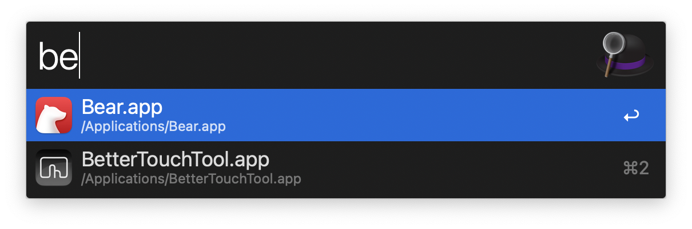
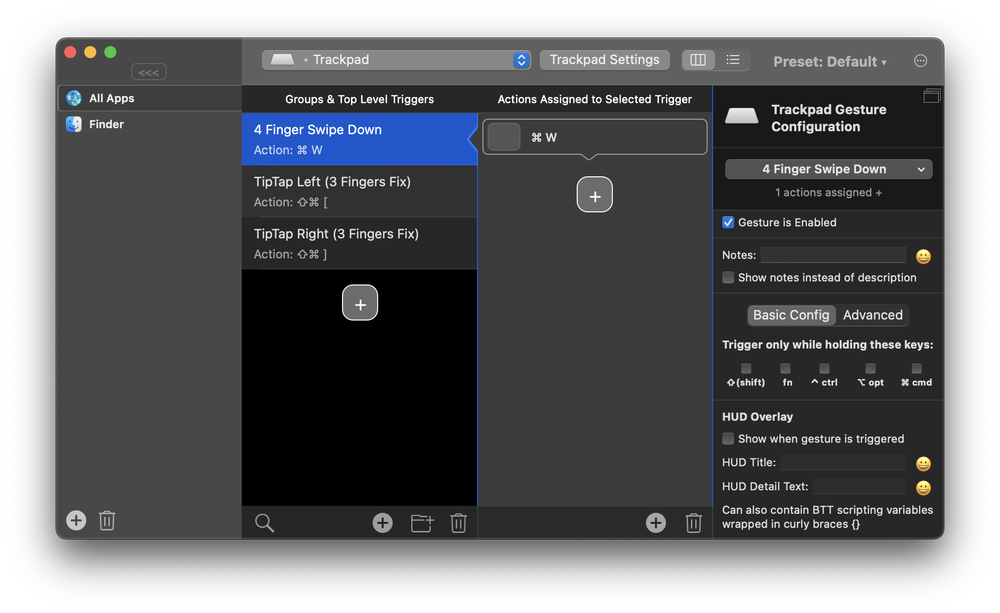
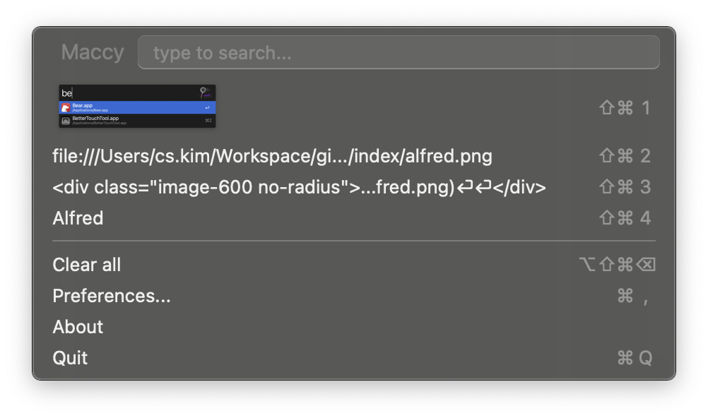

# 필수 앱 목록

많은 분들께 유용한 필수 애플리케이션을 소개합니다.

## Alfred <Badge text="부분 유료" />

<div class="image-600 no-radius">



</div>

향상된 스팟라이트

**설치**

```sh
brew install --cask alfred
```

[공식 홈페이지](https://www.alfredapp.com/)

## Better Touch Tool <Badge text="유료" />



제스처 커스터마이징 도구

**설치**

```sh
brew install --cask bettertouchtool
```

[공식 홈페이지](https://folivora.ai/)

## IINA <Badge text="무료" />


다양한 코덱을 지원하는 동영상 플레이어

**설치**

```sh
brew install --cask iina
```

[공식 홈페이지](https://iina.io/)

[공식 홈페이지](https://maccy.app/)

## Keka <Badge text="무료" />

<div class="image-300 no-radius">


</div>

한글 파일명을 잘 지원하는 무료 압축 프로그램

**설치**

```sh
brew install --cask keka
```

[공식 홈페이지](https://www.keka.io/ko/)

## Maccy <Badge text="무료" />

<div class="image-450 no-radius">



</div>

클립보드 관리 프로그램

**설치**

```sh
brew install --cask maccy
```
