# 패키지 관리자 (Apple Silicon/M1)

:::warning Intel
이 페이지는 **Apple Silicon 사용자**를 대상으로 작성하였습니다.  
Intel 사용자는 [패키지 관리자 (Intel)](./index) 페이지를 확인하세요.
:::

<div class="image-600">

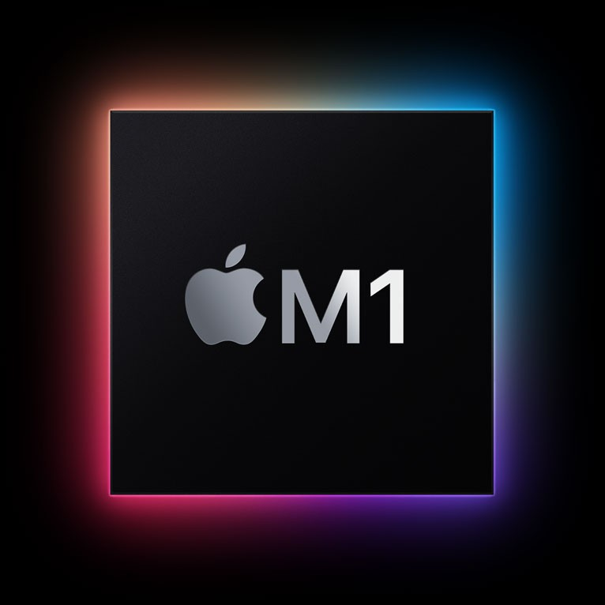

</div>

2020년 11월 Intel 대신 M1 CPU가 탑재된 Mac이 등장하고 개발 환경에 작은(?) 변화가 생겼습니다. 생각보다 빠르게 많은 개발 도구들이 M1을 지원하기 시작했지만 아직은 혼란스러운 상황으로 설정이 조금 복잡해졌습니다.

Apple Silicon의 특징을 알아보고 개발환경을 설정해 봅시다.

## Apple Silicon (M1)

Intel 프로세서 아키텍처는 `x86_64`이고 Apple Silicon M1은 `arm64` 아키텍처입니다. Apple은 M1에서 Intel 기반의 앱을 지원하기 위해 `Rosetta 2`라는 에뮬레이터를 만들었습니다. Rosetta 2는 백그라운드에서 작동하며, Apple Silicon에서 사용할 수 있도록 Intel 기반 앱을 자동으로 변환합니다.

Rosetta 2를 사용한 앱은 놀랍게도 네이티브와 거의 성능차이가 느껴지지 않습니다. ~~기술력 무엇?!~~ Apple Silicon 용으로 새로 빌드한 앱을 사용하는게 가장 좋지만, Intel 기반 앱을 사용해도 큰 이슈는 없습니다. 대부분 잘 실행되니까요.

M1 등장 이후 앱은 총 3가지 방식으로 제공됩니다.

1. Apple Silicon 기반 앱
2. Intel 기반 앱
3. 알아서 둘다 돌아가는 Universal 앱

Apple Silicon 기반 Mac을 사용하는 사용자는 1번 또는 3번을 사용하고 없으면 2번을 사용하면 됩니다. 참 쉽죠??

**⚠️ 하지만, 개발환경은 상황이 조금 다릅니다. ⚠️**

CLI 프로그램도 앱과 동일하게 `arm64` 빌드를 우선 사용하고, 없으면 `x86_64` 빌드를 사용하면 됩니다. 예를 들어 Node.js 최신버전은 `arm64`와 `x86_64` 빌드를 제공하지만, 구버전은 `x86_64`빌드만 제공하므로 최신버전은 네이티브로, 구버전은 `Rosetta 2`로 변환하여 사용할 수 있습니다.

문제는 **설치하는 과정**입니다. Node.js는 버전관리 프로그램(`nvm`이나 `asdf`)을 사용하는 것이 일반적인데 `arm64` 아키텍처는 구버전을 설치할 수가 없습니다. 동일한 버전관리 프로그램을 상황에 따라 최신버전은 `arm64`를 사용하고 구버전은 `x86_64`를 사용하는 방법이 필요한 것이죠.

가장 좋은건 모든 개발환경을 `arm64`로 통일하는 것이지만, 레거시~~부들부들~~와 의존성 라이브러리 이슈로 한동안 아키텍처를 혼용할 수 밖에 없습니다.

`Rosetta 2`를 설치하고 아키텍처를 혼용해서 사용하는 방법을 알아봅니다.

:::tip 성능비교
[쿠버네티스 안내서](https://subicura.com/k8s/) 빌드속도를 이용한 대략적인 성능은 다음과 같습니다. (\*시간이 짧을수록 빠름/5회 평균)

Native vs Rosetta

- MacBook Air 2020 / M1 / Node.js 16.8.0 (arm64 build): `8.1s`
- MacBook Air 2020 / M1 / Node.js 16.8.0 (x86_64 build) Rosetta 2: `16.9s`

Intel Sample

- MacBook Pro 2019 / 2.6 GHz 6-Core Intel Core i7 / Node.js 16.8.0: `14.4s`
- iMac 2020 / 3.8 GHz 8-Core Intel Core i7 / Node.js 16.8.0: `11.5s`

arm64 네이티브가 가장 빠르고, Rosetta 2를 이용한 x86_64 가상화도 그럭저럭 쓸만한 성능을 보여줍니다.

:::

### Rosetta 2 설치

x86_64 프로그램을 실행하면 자동으로 설치 안내 팝업이 뜹니다. 수동으로 설치하려면 다음 명령어를 입력합니다.

```sh
softwareupdate --install-rosetta --agree-to-license
```

### 활성 상태 보기<sup>Activity Monitor</sup>

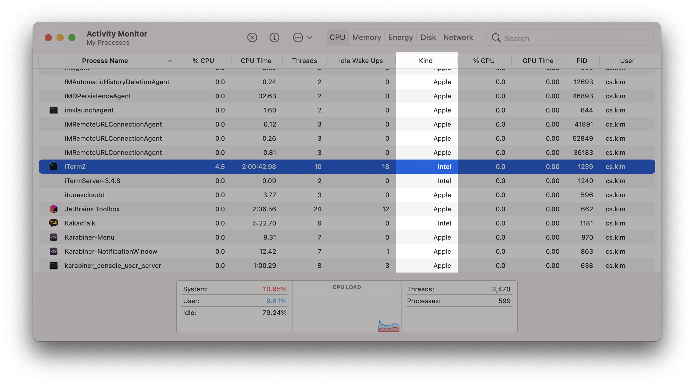

현재 애플리케이션이 어떤 아키텍처로 동작하는지(Rosetta를 사용한건지) 확인하려면 Active Monitor를 확인하세요.

- `Apple`: arm64 (Native)
- `Intel`: x86_64 (Rosetta 2)

### x86_64 터미널 실행

개발 환경을 x86_64로 설정하는 가장 쉬운 방법은 터미널 프로그램을 Rosetta로 실행하는 방법입니다.

터미널 프로그램(Terminal 또는 iTerm2) 아이콘에서 오른쪽 버튼 누르고 `Get Info`를 선택하고 `Open using Rosetta`를 체크합니다.

<div class="image-350 no-radius">

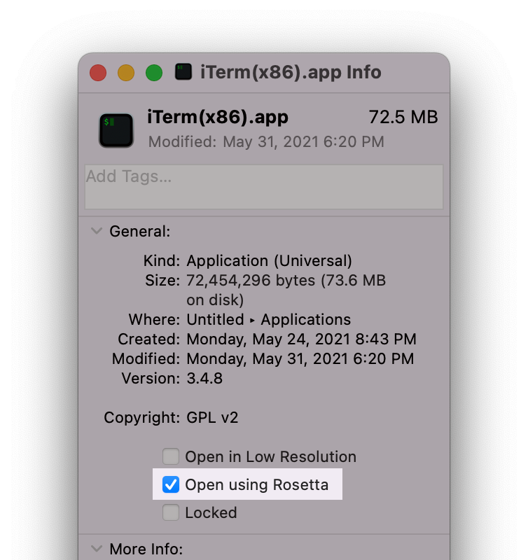

</div>

이제 터미널 명령어가 x86_64기반으로 실행됩니다.

그.런.데 매번 `Open using Rosetta`를 껐다 킬수는 없으므로 앱을 복사하여 2개를 설정합니다.

<div class="image-450 no-radius">

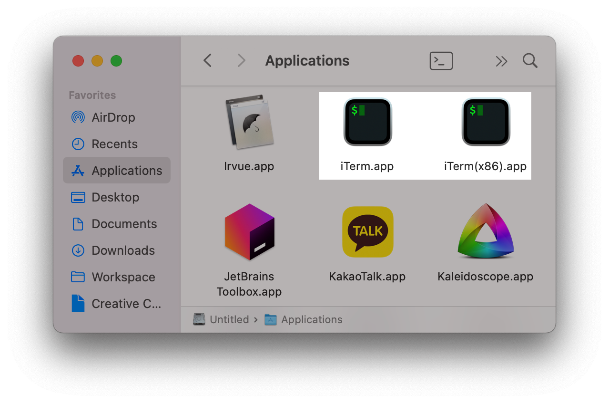

</div>

1. `Applications` 폴더의 `iTerm` 아이콘에서 오른쪽 버튼 누르고 `복제`<sup>Duplicate</sup>를 선택합니다.
2. 복제한 앱 이름을 `iTerm(x86)`으로 변경합니다.
3. `iTerm(x86)` 아이콘에서 오른쪽 버튼 누르고 `Get Info`를 선택하고 `Open using Rosetta`를 체크합니다.

이제 평소엔 `iTerm`을 사용하고 설치나 빌드 오류가 발생하여 x86_64 가상화가 필요한 경우 `iTerm(x86)`을 사용합니다.

:::warning 터미널 2개가 복잡해요 ;ㅁ;

터미널 2개를 사용하는 방식이 복잡하거나 x86_64 기반 개발을 주로 한다면, `Open using Rosetta`를 체크한 터미널 하나만 사용하는 것이 가장 속편한 방법입니다. M1 출시 초반, 많은 프로그램이 `arm64`를 지원하지 않을때 주로 사용했던 방법이고 `Rosetta 2`가 쓸만하기 때문에 꽤 괜찮은 성능을 보여줍니다.

:::

### iTerm Status Bar

지금 사용중인 터미널의 프로세서 아키텍처를 iTerm 상태바에 추가합니다.

<div class="image-600 no-radius">

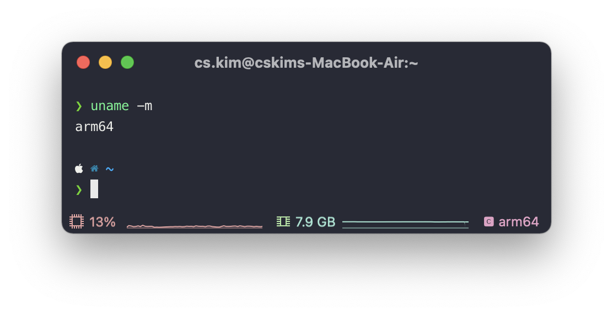
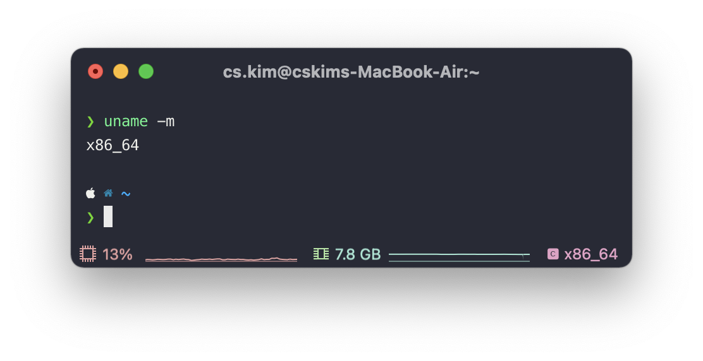

</div>

iTerm에서 Shell 정보를 가져오도록 `iTerm2` > `Install Shell Integration`을 선택합니다.

<div class="image-600 no-radius">

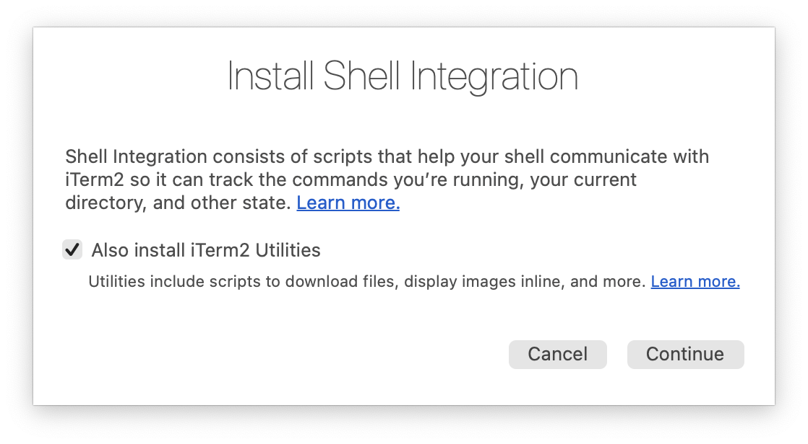

</div>

설치가 완료되면, 다음 명령어를 입력하여 프로세서 아키텍처 명령어(`uname -m`)를 `\(user.cpu)`로 연동합니다.

```sh
cat <<'EOF' >> ~/.zprofile
iterm2_print_user_vars() {
  CPU=$(uname -m)
  iterm2_set_user_var cpu $CPU
}

EOF
```

이제 iTerm 관련 프로필을 설정합니다.

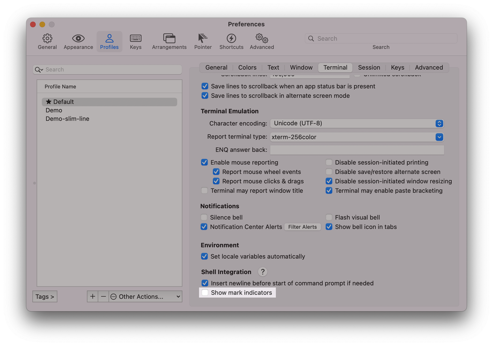

`Shell Integration`을 하면 쉘 프롬프트에 삼각형 마커가 추가되는데 불필요하므로 제거합니다.

- `Profiles` > `Terminal`: Show mark indicators 체크 해제

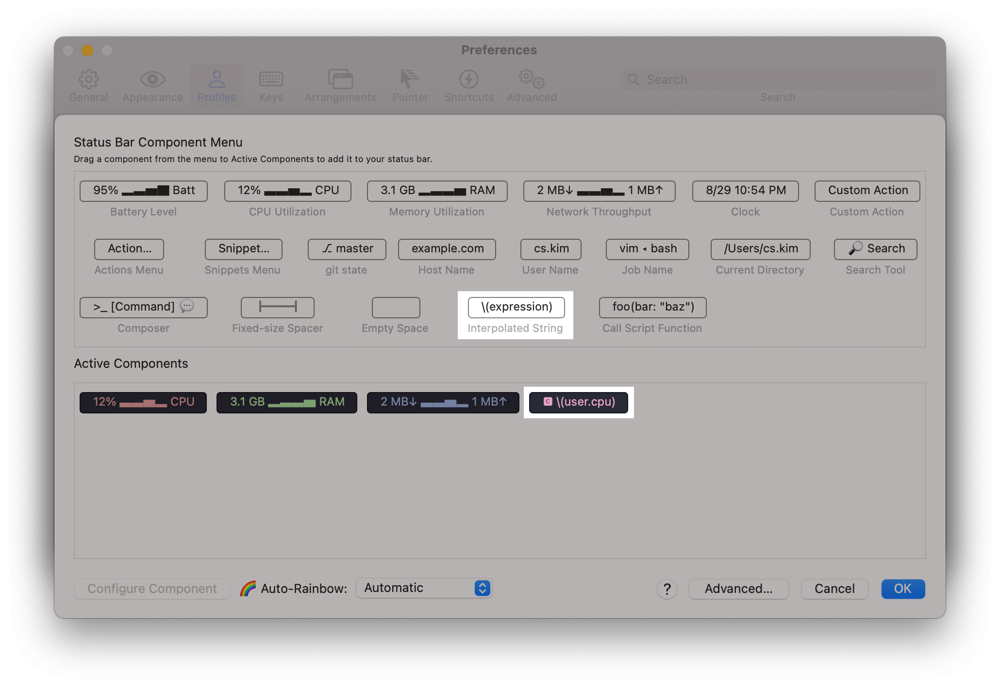

`Status Bar`에서 `Interpolated String`를 드래그하여 추가합니다.

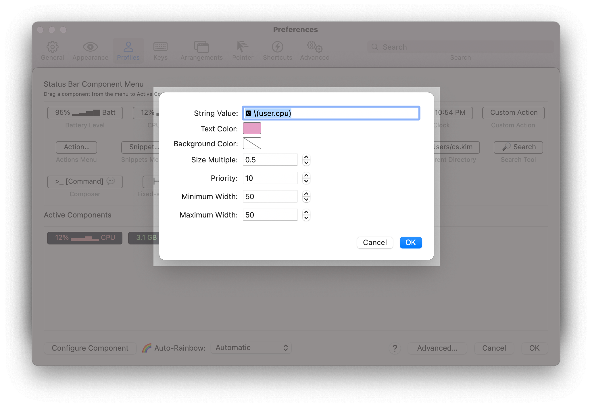

`Configure Component`를 선택하고 `String Value`에 `🅲 \(user.cpu)`를 입력합니다. 그 외에 사이즈나 우선순위등을 변경합니다.

### 아키텍처 관련 명령어

현재 터미널이 어떤 아키텍처로 실행중인지 확인해보겠습니다.

기본 터미널은 `arm64`로 실행되지만 `Open using Rosetta`로 실행했다면 `x86_64`로 보입니다.

```sh
$ uname -m
# arm64
# x86_64
```

`arch` 명령어를 입력하면 실행한 터미널 환경과 상관없이 강제로 특정 아키텍처로 앱을 실행할 수 있습니다.

```sh
$ arch -x86_64 /bin/zsh # Intel
$ uname -m
x86_64

$ arch -arm64 /bin/zsh # Apple Silicon (M1)
$ uname -m
arm64
```

**프로그램 지원 여부 확인**

`file` 명령어로 바이너리가 지원하는 아키텍처를 확인할 수 있습니다.

Intel만 지원하는 바이너리(x86_64):

```sh
$ file /usr/local/bin/nvim
/usr/local/bin/nvim: Mach-O 64-bit executable x86_64
```

Apple Silicon(M1)만 지원하는 바이너리(arm64):

```sh
$ file /opt/homebrew/bin/jq
/opt/homebrew/bin/jq: Mach-O 64-bit executable arm64
```

Intel과 Apple Silicon 둘 다 지원하는 바이너리:

```sh
$ file /bin/zsh
/bin/zsh: Mach-O universal binary with 2 architectures: [x86_64:Mach-O 64-bit executable x86_64][arm64e:mach-o 64-bit executable arm64e]
/bin/zsh (for architecture x86_64): Mach-O 64-bit executable x86_64
/bin/zsh (for architecture arm64e): Mach-O 64-bit executable arm64e
```

## Command Line Tools

M1의 특성을 어느정도 알았으니, 본격적으로 개발환경을 설정합니다.

macOS는 기본적으로 `gcc`, `make`와 같은 컴파일 도구가 설치되어 있지 않기 때문에 명령어 도구<sup>Command Line Tools</sup>를 설치해야 합니다. Xcode를 설치해도 되지만 iOS 개발을 할게 아니라면 용량이 작은 명령어 도구만 따로 설치합니다.

**설치**

CLI에서 `gcc`나 `python`같은 명령어를 입력하면 자동으로 다음과 같은 화면이 뜨고 `Install`을 선택하면 명령어 도구를 설치합니다.  
(iTerm 실행시 설치했다면 skip!)

<div class="image-450 no-radius">

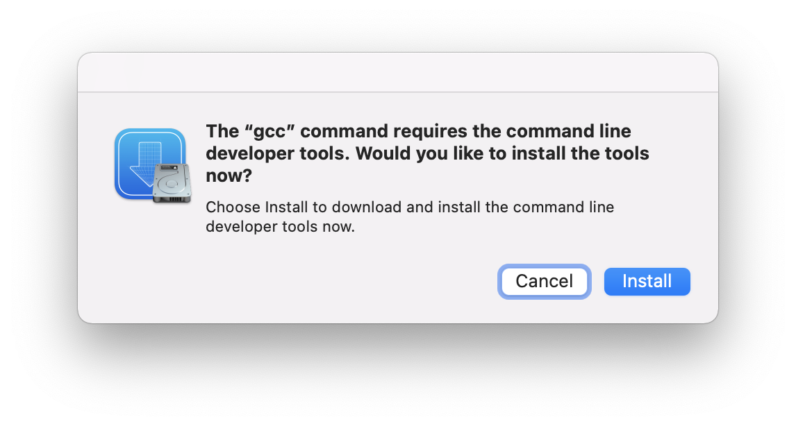

</div>

수동으로 설치하려면 다음 명령어를 입력합니다.

```sh
xcode-select --install
```

**설치 확인**

```sh
# gcc test

$ gcc
clang: error: no input files
```

## Homebrew

brew<sup>homebrew</sup>는 각종 커맨드라인 프로그램과 일반 애플리케이션(크롬..)을 손쉽게 설치해주는 Mac용 패키지 매니저입니다. 리눅스의 `apt`나 `yum`과 비슷하며 다양한 프로그램을 복잡한 빌드과정 없이 손쉽게 설치하고 업데이트, 관리도 간단하므로 개발을 할 때 반드시 설치해야 하는 필수 프로그램입니다. `그냥 홈페이지 가서 다운로드 하고 설치하는 게 편한데..`라고 할수 있지만, 나중에 업데이트나 삭제를 생각해보면 글쎄요.. brew 쓰세요!

**설치**

`x86_64`와 `arm64` 두가지 brew를 모두 설치하고 실행중인 터미널 환경에 맞는 `brew`가 실행되도록 `~/.zprofile`에 분기 설정을 합니다. 그리고 `arm64` 터미널에서 `x86_64`만 지원하는 프로그램을 설치할 수 있도록 `ibrew` alias를 추가합니다.

```sh
# install homebrew (arm64)
arch -arm64 /bin/bash -c "$(curl -fsSL https://raw.githubusercontent.com/Homebrew/install/master/install.sh)"
# install homebrew (x86_64)
arch -x86_64 /bin/bash -c "$(curl -fsSL https://raw.githubusercontent.com/Homebrew/install/master/install.sh)"

# set homebrew env
cat <<'EOF' >> ~/.zprofile
CPU=$(uname -m)
if [[ "$CPU" == "arm64" ]]; then
  eval "$(/opt/homebrew/bin/brew shellenv)"
else
  export PATH=/opt/homebrew/bin:$PATH
  eval "$(/usr/local/bin/brew shellenv)"
fi

alias ibrew="arch -x86_64 /usr/local/bin/brew"
alias abrew="arch -arm64 /opt/homebrew/bin/brew"

EOF
```

터미널을 재시작합니다.

**설치 확인**

```sh
# brew test
$ brew doctor
Your system is ready to brew.
```

## Git

버전 관리 도구로 유명한 git입니다. 다들 아시죠? macOS에 기본으로 설치되어 있지만 최신 버전이 아니므로 brew를 이용해서 업데이트 합니다. git-lfs 는 Git Large File Storage로 용량이 큰 바이너리 파일을 git으로 관리할 때 유용합니다. git 설치할 때 같이 설치합니다.

**설치**

```sh
brew install git git-lfs
```

git 설치가 완료되었으면 개인정보를 설정하고 맥에서 한글 파일명을 정상적으로 처리하기 위해 추가 옵션을 설정합니다. ~~망할 한글처리~~

**설정**

```sh
git lfs install
git config --global user.name "Your Name"
git config --global user.email "you@your-domain.com"
git config --global core.precomposeunicode true
git config --global core.quotepath false
```
