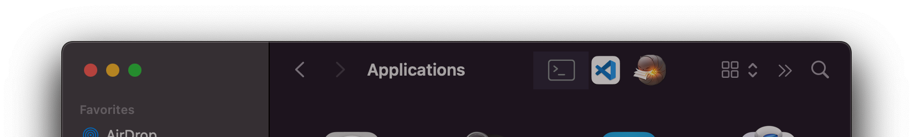
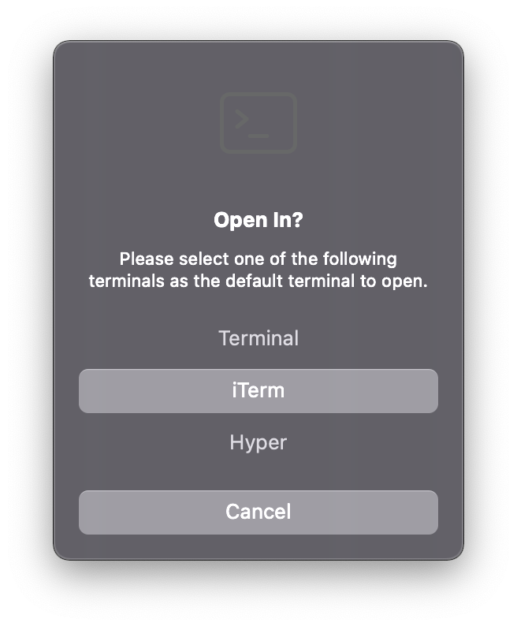
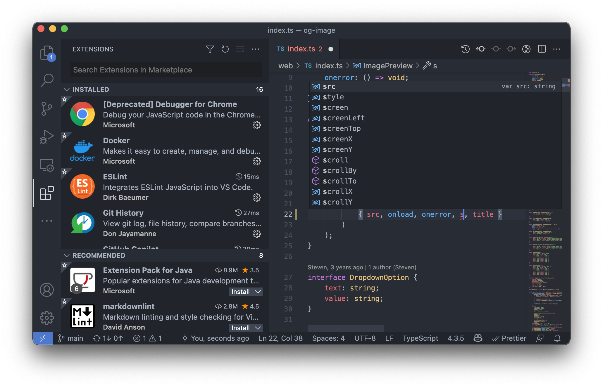
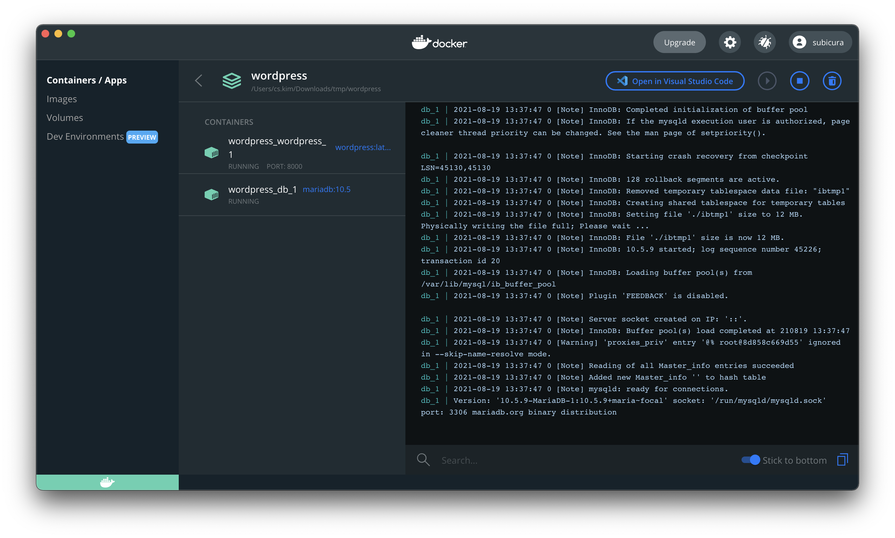
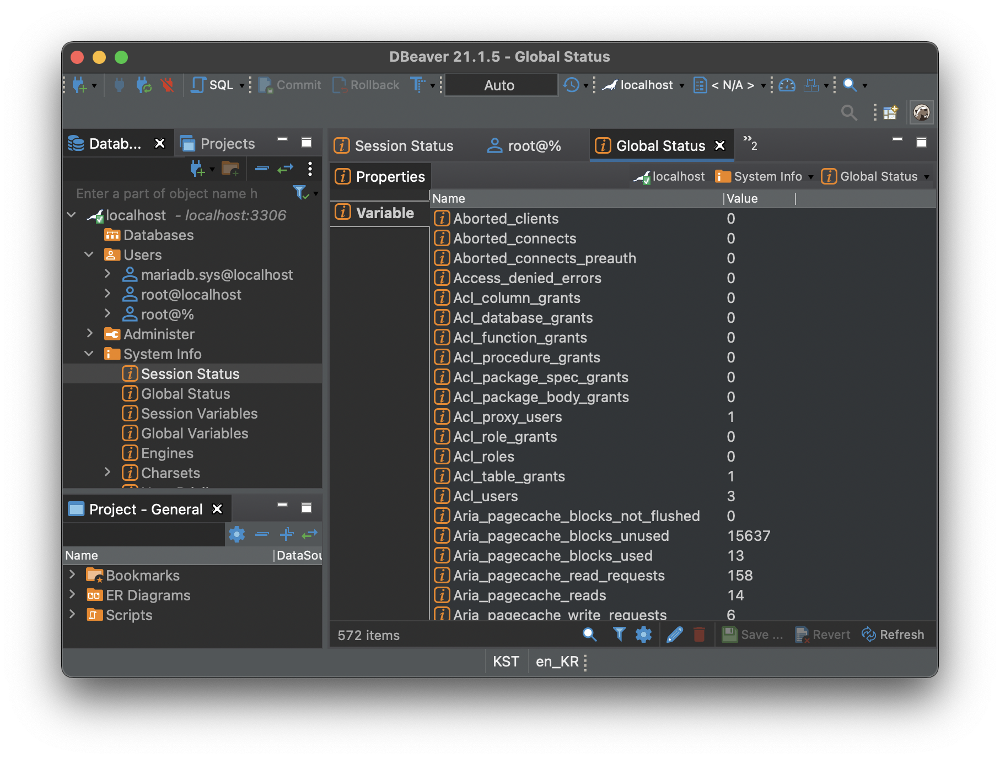
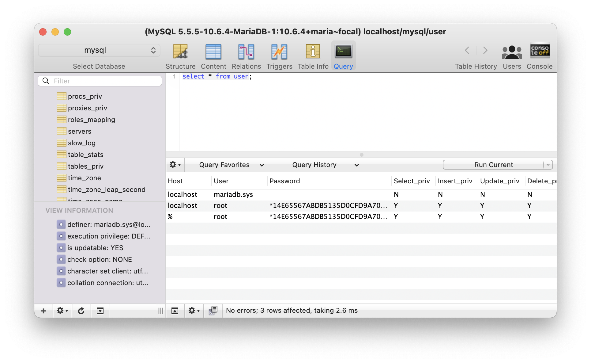
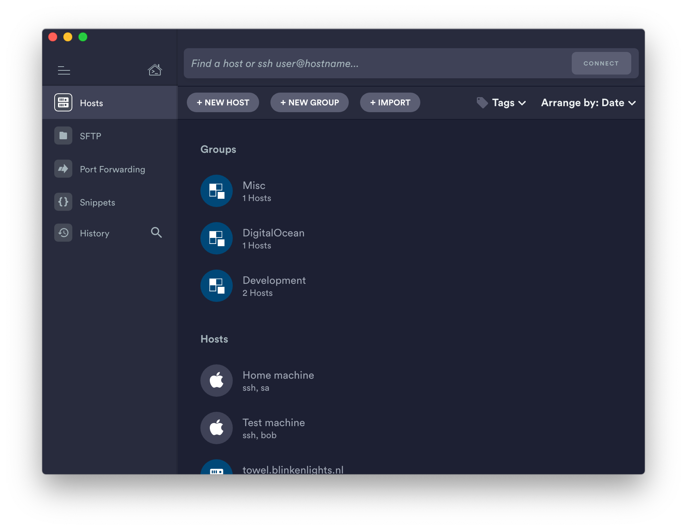

# 개발 앱

## OpenInTerminal



파인더에서 바로 터미널을 열고 싶을 때 클릭한번으로 열 수 있는 유용한 도구 입니다. 프로그램을 설치하고 `⌘` + `드래그`로 파인더 도구막대에 앱 바로가기를 추가할 수 있습니다.

**설치**

```sh
brew install --cask openinterminal-lite
```

<div class="image-300 no-radius">



</div>

원하는 터미널 앱을 선택합니다.

[OpenInTerminal GitHub](https://github.com/Ji4n1ng/OpenInTerminal)

**설치**

```sh
brew install --cask openinterminal-lite
```

## Visual Studio Code



가장 널리 쓰이는 코드 편집기입니다.

[Visual Studio Code 홈페이지](https://code.visualstudio.com/)

**설치**

```sh
brew install --cask visual-studio-code
```

## Docker



따로 소개할 필요가 없을 정도로 유명한 가상화 프로그램입니다. MySQL, Redis와 같은 데이터베이스나 rails, php 개발환경까지 두루두루 사용하고 있습니다. 하나의 개발 피시에 여러버전의 MySQL이나 Redis를 설치하는 건 쉽지 않은데 docker를 사용하면 쉽고 간단하게 개발환경을 구축할 수 있습니다.

docker에 대한 자세한 내용은 [여기](https://subicura.com/2017/01/19/docker-guide-for-beginners-1.html)서 확인하세요.

**설치**

```sh
brew install --cask docker
```

[Docker](https://www.docker.com/) / [Docker Desktop](https://www.docker.com/products/docker-desktop)

## DBeaver



종합 데이터베이스 관리 도구 입니다. 무료로 다양한 디비를 관리하고 싶을 때 추천합니다.

**설치**

```sh
brew install --cask dbeaver-community
```

[DBeaver 홈페이지](https://dbeaver.io/)

## Sequel Pro



예쁜 MySQL 관리 도구입니다.

**설치**

```sh
brew install --cask sequel-pro
```

[Sequel Pro 홈페이지](https://www.sequelpro.com/)

## Termius



안전하고 손쉽게 계정과 키를 공유하여 사용할 수 있는 강력한 터미널 클라이언트입니다.

iOS/Android/macOS/Windows/Linux등 대부분의 기기를 지원하고 로그인을 하면 이전 기기에서 사용했던 접속정보를 개인키까지 모두 동기화 됩니다.

모든 데이터는 암호화되어 저장되며 모든 기기와 안전하게 동기화됩니다.

**설치**

```sh
brew install --cask termius
```
