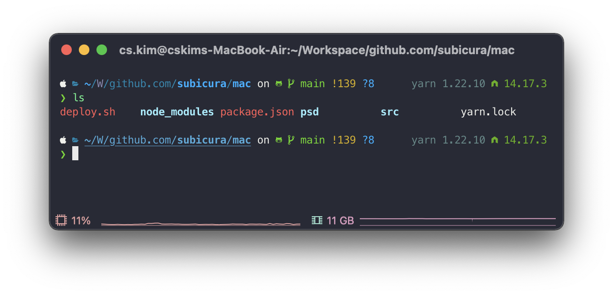
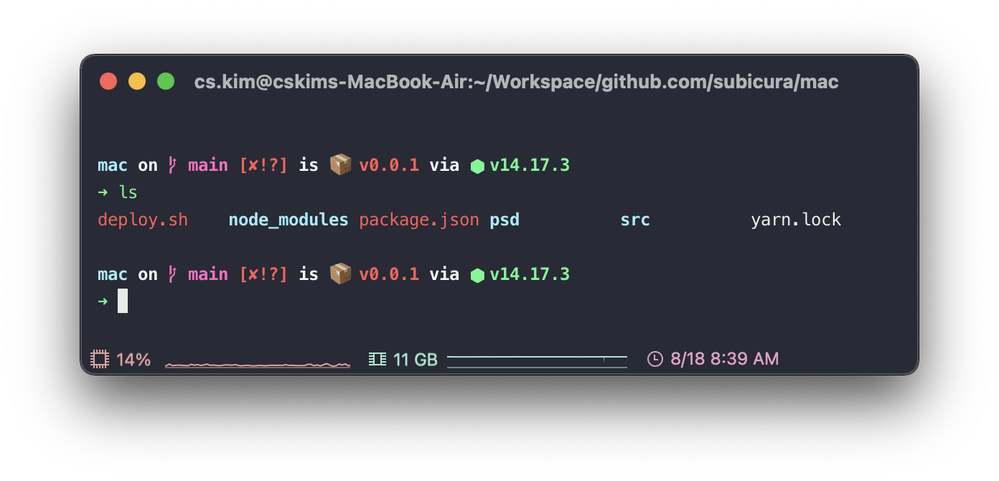
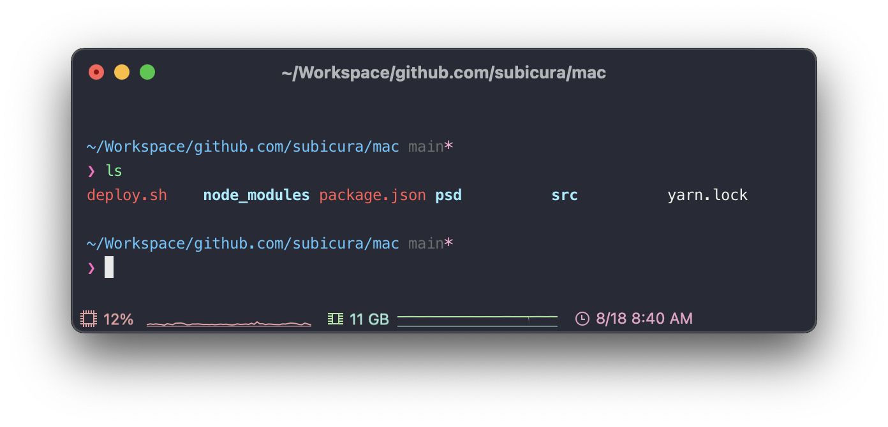

# 쉘 프롬프트 설정

Unix계열의 꽃! 쉘을 이쁘게 꾸며봅시다.

[oh-my-zsh](https://github.com/ohmyzsh/ohmyzsh)을 설치하고 플러그인을 셋팅한 다음, 쉘 프롬프트를 설정합니다.

## oh-my-zsh 설치

zsh 설정을 위한 oh-my-zsh을 설치합니다.

```sh
sh -c "$(curl -fsSL https://raw.githubusercontent.com/ohmyzsh/ohmyzsh/master/tools/install.sh)"
```

설치스크립트를 실행하면 관련 파일을 설치하고 패스워드를 물어봅니다.

:::warning .zshrc
`oh-my-zsh` 설치 전, `.zshrc` 파일을 생성했다면 기존파일을 `.zshrc.pre-oh-my-zsh` 파일로 백업 후 덮어씁니다. 필요한 설정을 다시 `.zshrc`에 복사합니다.
:::

## oh-my-zsh 플러그인

oh-my-zsh의 가장 강력한 점은 플러그인입니다. [기본 플러그인](https://github.com/ohmyzsh/ohmyzsh/wiki/Plugins)외에 명령어 하이라이팅 플러그인 [zsh-syntax-highlighting](https://github.com/zsh-users/zsh-syntax-highlighting)과 자동완성 플러그인 [zsh-autosuggestions](https://github.com/zsh-users/zsh-autosuggestions)을 설치합니다.

```sh
# zsh-syntax-highlighting
git clone https://github.com/zsh-users/zsh-syntax-highlighting.git ${ZSH_CUSTOM:-~/.oh-my-zsh/custom}/plugins/zsh-syntax-highlighting

# zsh-autosuggestions
git clone git://github.com/zsh-users/zsh-autosuggestions $ZSH_CUSTOM/plugins/zsh-autosuggestions
```

플러그인을 설치하면 반드시 `~/.zshrc`파일에 설정을 해야 합니다. 파일을 열고 `plugins`항목에 플러그인을 추가합니다.

```sh
plugins=(
  git
  zsh-syntax-highlighting
  zsh-autosuggestions
)
```

설정 파일을 수정했으면 터미널을 재시작하거나 `source ~/.zshrc` 명령어를 실행하여 설정을 다시 불러와야 합니다. 이제 명령어를 입력할 때 존재하지 않는 명령어는 빨간색으로 뜨고 한번 입력했던 명령어를 흐릿하게 표현해주는 걸 확인할 수 있습니다.

## 쉘 프롬프트

oh-my-zsh의 기본 테마인 `robbyrussell`도 깔끔하지만, 이 외에 다양한 테마가 존재합니다. 테마를 바꾸는 방법은 `~/.zshrc`파일의 `ZSH_THEME="robbyrussell"` 부분을 원하는 테마로 수정하면 됩니다.

여기서는 단순히 색상, 모양 설정을 넘어 추가적인 기능을 설치합니다. 추가적인 기능은 현재 디렉토리의 git 상태를 보여주고 사용중인 nodejs, ruby의 버전을 보여주거나 aws, kubectl 프로필을 보여주기도 합니다.

대표적인 프롬프트는 [Powerlevel10k](https://github.com/romkatv/powerlevel10k), [spaceship](https://spaceship-prompt.sh/), [pure](https://github.com/sindresorhus/pure)가 있습니다. 취향에 맞춰서 사용하면 되고 개인적으로 예전에는 pure를 썼지만 최근에는 Powerlevel10k를 사용하고 있습니다. Powerlevel10k는 쉘응답속도와 프롬프트 초기화가 가장 빠르고 Lean테마를 사용하면 단순한 형태로 사용할 수 있습니다. 특히 `aws`, `kubectl`등 특정 명령어를 칠때만 나타나는 프로필 기능이 아주 마음에 듭니다.

- 속도비교: `powerline10k` >>>> `spaceship`, `pure`
- 기능비교: `powerline10` > `spaceship` >>>> `pure`
- 디자인비교 (취향탐): `spaceship`, `pure` > `powerline10k`

### Powerlevel10k <Badge text="추천" type="info"/>

<div class="image-600 no-radius">



</div>

```sh
git clone --depth=1 https://github.com/romkatv/powerlevel10k.git ${ZSH_CUSTOM:-~/.oh-my-zsh/custom}/themes/powerlevel10k
```

설치를 완료하면 ~/.zshrc파일에 ZSH_THEME항목을 수정합니다.

```sh
ZSH_THEME="powerlevel10k/powerlevel10k"
```

저장 후 새로 탭을 열면, 대화형 설정창이 뜨고 상세하게 테마를 설정할 수 있습니다. 다시 설정하고 싶다면 언제든 `p10k configure`를 입력하면 됩니다.

### spaceship(설정귀찮으면 추천)

<div class="image-600 no-radius">



</div>

```sh
git clone https://github.com/denysdovhan/spaceship-prompt.git "$ZSH_CUSTOM/themes/spaceship-prompt"
ln -s "$ZSH_CUSTOM/themes/spaceship-prompt/spaceship.zsh-theme" "$ZSH_CUSTOM/themes/spaceship.zsh-theme"
```

설치를 완료하면 `~/.zshrc`파일에 ZSH_THEME항목을 수정합니다.

```sh
ZSH_THEME="spaceship"
```

### pure

<div class="image-600 no-radius">



</div>

```sh
brew install nodejs # nodejs가 설치되어 있다면 skip
npm install --global pure-prompt
```

설치를 완료하면 `~/.zshrc`파일에 다음항목을 추가합니다.

```sh
autoload -U promptinit; promptinit
prompt pure
```
