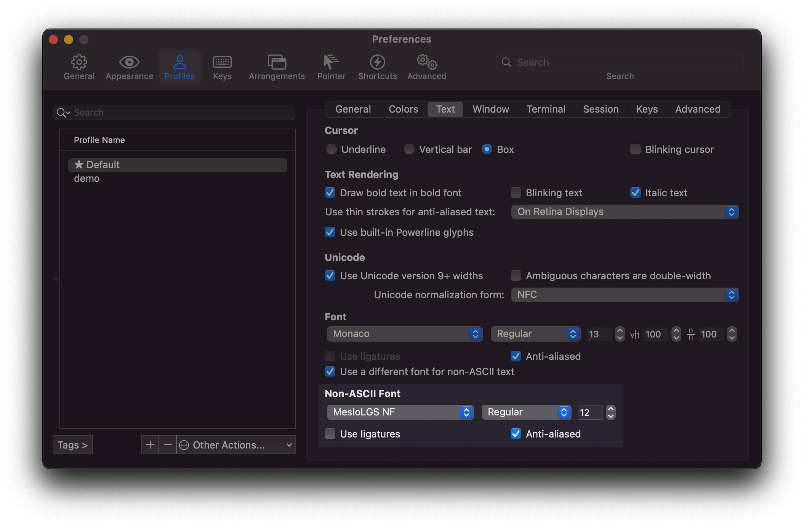

# CLI 프로그램

## neovim


vim은 기본으로 설치된 터미널용 에디터로 GUI 환경의 에디터를 사용할 수 있는 macOS 환경에서는 일부 고오오급 개발자를 제외하고는 잘 쓰이지 않습니다. 하지만 터미널 작업을 하다 보면 간단하게 수정할 파일이 있고 git 커밋메시지를 작성할 때 종종 사용하게 됩니다.

기본으로 설정된 화면은 밋밋하기 그지 없기 때문에 강력한 기능의 플러그인을 설치해줍니다.

**설치**

내장된 vim대신 neovim을 설치합니다. neovim은 vim과 차이가 없어 보이는데 24bit True Color를 지원하고 오래된 vim 소스를 처음부터 다시 짜서 소스코드가 줄었다고 합니다. 저 같은 라이트 유저는 차이를 느끼진 못하지만 좋다고 해서 사용하고 있습니다. 그리고 테마에서 사용할 개발용 폰트를 설치합니다.

:::tip 이미 개발용 폰트가 설치되어 있나요?
`Powerline10k` 쉘 프롬프트를 사용하면 개발용 폰트(MesloLGS NF)가 자동으로 설치됩니다. 따로 설치할 필요가 없습니다.
:::

```sh
brew install neovim
# MesloLGS NF가 없는 경우
brew tap homebrew/cask-fonts
brew install font-meslo-lg-nerd-font
```

기본 설치가 완료되었으면 터미널 기본 에디터로 vi대신 neovim을 사용하도록 `~/.zshrc`에 다음 항목을 추가합니다.

```sh
alias vim="nvim"
alias vi="nvim"
alias vimdiff="nvim -d"
export EDITOR=/usr/local/bin/nvim # M1이면 /opt/homebrew/bin/nvim
```

`source ~/.zshrc`를 입력하여 설정을 다시 불러옵니다.

**플러그인**

vim은 강력한 플러그인들이 많은데 설치가 어렵고 어떤 게 좋은지 라이트 유저는 알 수가 없습니다. SpaceVim이라는 프로젝트는 가장 많은 사람들이 사용하는 플러그인을 자동으로 설치해줍니다. 약간 무거운 느낌이 있긴 하지만 설치가 간단하고 화면을 보는 순간 고오오급 개발자의 포스를 만들어주니 바로 설치해봅니다.

```sh
curl -sLf https://spacevim.org/install.sh | bash
```

설치가 완료되면 `vi`를 실행합니다. 최초 실행 시 mode 설정을 물어보고 (잘모르면 `1`을 누릅니다) `q`를 눌러 종료했다가 다시 실행하면 자동으로 플러그인을 설치합니다. 플러그인이 많아서 시간이 꽤 걸립니다.

기본 테마는 뭔가 칙칙한 느낌이 듭니다. snazzy colorscheme를 다운받고 `~/.SpaceVim.d/init.toml` 파일에 설정을 추가합니다.

```sh
mkdir ~/.SpaceVim.d/colors
curl https://gist.githubusercontent.com/subicura/91696d2da58ad28b5e8b2877193015e1/raw/6fb5928c9bda2040b3c9561d1e928231dbcc9184/snazzy-custom.vim -o ~/.SpaceVim.d/colors/snazzy-custom.vim
```

```
[options]
  colorscheme = "snazzy-custom"
  enable_guicolors = true
  statusline_separator = "arrow"
  enable_tabline_filetype_icon = true
  enable_statusline_mode = true
  statusline_unicode_symbols = true
```

설정 파일을 수정하고 다시 시작하면 좀 더 나은 화면을 볼 수 있습니다.

**폰트**

vi를 실행하고 폰트가 `?`로 깨져 보인다면 iTerm2에 개발 관련 폰트를 모은 NerdFont를 추가로 설정합니다.



iTerm2를 실행하고 설정(`⌘` + `,`)창에서 `Profiles` 항목을 선택하고 `Text`탭을 선택합니다. Font항목에서 `Use a different font for non-ASCII text`를 체크하고 MesloLGS NF를 선택하면 폰트가 이쁘게 나옵니다.

이제 설정이 모두 완료되었으니 vim 공부(`esc`, `:q!`)만 하면 됩니다. :)

[neovim 홈페이지](https://neovim.io/) / [SpaceVim GitHub](https://github.com/SpaceVim/SpaceVim) / [SpaceVim 설정](https://spacevim.org/documentation/)

## fzf

fzf는 강력하고 엄청나게 빠른 fuzzy finder 도구입니다. 증분 검색을 통하여 원하는 파일이나 히스토리를 쉽고 빠르게 찾을 수 있게 해줍니다. 정확하게 원하는 값을 입력하지 않고 일부만 입력해도 실시간으로 검색 결과를 보여줍니다.


**설치**

```sh
brew install fzf
```

설치가 완료되었으면 `~/.zshrc`에 plugin을 추가해줍니다.

```sh
plugins=(
  ...
  ...
  fzf
)
```

전부 완료되었으면 `source ~/.zshrc`를 입력하여 설정을 다시 불러옵니다.

**명령어**

정말 다양한 기능이 있지만 여기선 가장 기본적인 기능만 살펴봅니다.

| 단축키      | 기능                       |
| ----------- | -------------------------- |
| `⌃` + `T`   | 하위 디렉토리 파일 검색    |
| `⌃` + `R`   | 히스토리 검색              |
| `esc` + `C` | 하위 디렉토리 검색 후 이동 |

단축키 입력하고 글자를 몇 개 입력하면 금방 감이 옵니다. 취소는 `esc`입니다.

[fzf GitHub](https://github.com/junegunn/fzf)

## fasd

fasd는 사용빈도가 높은 파일 또는 디렉토리 검색을 편하게 해서 생산성을 향상시켜주는 도구입니다. 열어본 파일이나 이동한 디렉토리를 기억하고 우선순위를 정해서 빠르게 검색할 수 있게 도와줍니다.

**설치**

```sh
brew install fasd
```

설치가 완료되었으면 `~/.zshrc`에 plugin을 추가해줍니다.

```
plugins=(
  ...
  ...
  fasd
)
```

전부 완료되었으면 `source ~/.zshrc`를 입력하여 설정을 다시 불러옵니다.

**명령어**

명령어를 사용하기 위해서는 일단 디렉토리를 좀 이동하고 파일도 열어보고 해야 합니다. 어느 정도 히스토리가 쌓이면 명령어를 입력해봅니다.

| 단축키 | 기능                  |
| ------ | --------------------- |
| `z`    | 디렉토리 이동         |
| `s`    | 파일 or 디렉토리 검색 |

디렉토리를 이동할 때 `z github`, `tab`과 같이 일부 검색어를 입력하고 tab을 눌러서 이동합니다.

단순한 기능만큼 굉장히 자주, 유용하게 사용하는 도구입니다.

[fasd GitHub](https://github.com/clvv/fasd)

## asdf

asdf-vm은 각종 프로그램(nodejs, ruby, python, …)의 버전을 손쉽게 관리해주는 성의 없어 보이는 이름의 도구입니다. 기존에 nvm, rbenv등 언어, 프로그램별로 달랐던 관리 도구를 하나로 통합해서 사용할 수 있습니다. homebrew도 일부 버전 관리 기능을 제공하지만 asdf만큼 강력하지 않습니다.

**설치**

```sh
brew install asdf
```

설치가 완료되었으면 `~/.zshrc`에 plugin과 설정을 추가해줍니다.

```sh
plugins=(
  ...
  ...
  asdf
)

. $(brew --prefix asdf)/libexec/asdf.sh
```

**추가 설정 <Badge text="Apple Silicon(M1)" />**

Apple Silicon인 경우에, `x86_64`에서도 asdf를 설치하고 `~/.zprofile`에 `ASDF_DATA_DIR` 설정을 추가합니다.

```sh{7}
CPU=$(uname -m)
if [[ "$CPU" == "arm64" ]]; then
  eval "$(/opt/homebrew/bin/brew shellenv)"
else
  export PATH=/opt/homebrew/bin:$PATH
  eval "$(/usr/local/bin/brew shellenv)"
  export ASDF_DATA_DIR=$HOME/.asdf-x86
fi
```

`arm64`와 `x86_64`를 분리해서 관리할 수 있습니다.

전부 완료되었으면 `source ~/.zshrc`를 입력하여 설정을 다시 불러옵니다.

**명령어**

asdf는 플러그인을 이용하기 때문에 필요한 프로그램을 찾아서 설치해야 합니다.

| 명령어                               | 기능                                                                            |
| ------------------------------------ | ------------------------------------------------------------------------------- |
| `asdf plugin list`                   | 설치된 플러그인 목록                                                            |
| `asdf plugin add <name> [<git-ref>]` | 플러그인 설치 ex) asdf plugin add ruby https://github.com/asdf-vm/asdf-ruby.git |
| `asdf list all <name>`               | 플러그인 설치 가능한 버전 확인                                                  |
| `asdf install <name> <version>`      | 플러그인 버전 설치                                                              |
| `asdf local <name> <version>`        | 현재 경로 기준 버전 사용 설정                                                   |
| `asdf global <name> <version>`       | 전체 버전 사용 설정                                                             |

**Example**

```sh
# Node.js
brew install gpg
asdf plugin add nodejs
asdf plugin add yarn
asdf install 16.8.0
asdf global nodejs 16.8.0
```

[asdf-vm](https://asdf-vm.com/)

## jq

<div class="image-600 no-radius">


</div>

JSON 결과를 이쁘게 보여주고 원하는 대로 편집할 수 있는 도구입니다. 간단하게 필터를 적용하여 원하는 항목만 볼 수 있고 특정 결과를 다른 형태로 변경할 수 있습니다.

**설치**

```sh
brew install jq
```

[jq](https://stedolan.github.io/jq/)

## bat

<div class="image-600 no-radius">


</div>

cat명령어에 코드 하이라이팅 + more 기능이 추가된 버전입니다.

**설치**

```sh
brew install bat
```

~/.zshrc에 `cat` 대신 사용하도록 설정할 수 있습니다.

```sh
alias cat="bat"
```

Line Number를 제외하고 출력하고 싶다면 `-p`(plain) 옵션을 사용하세요.

[bat](https://github.com/sharkdp/bat)
