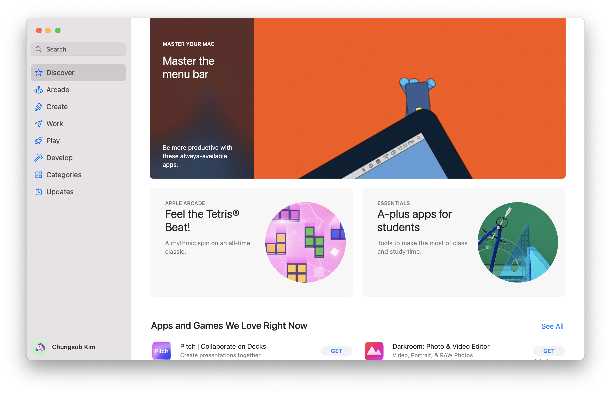
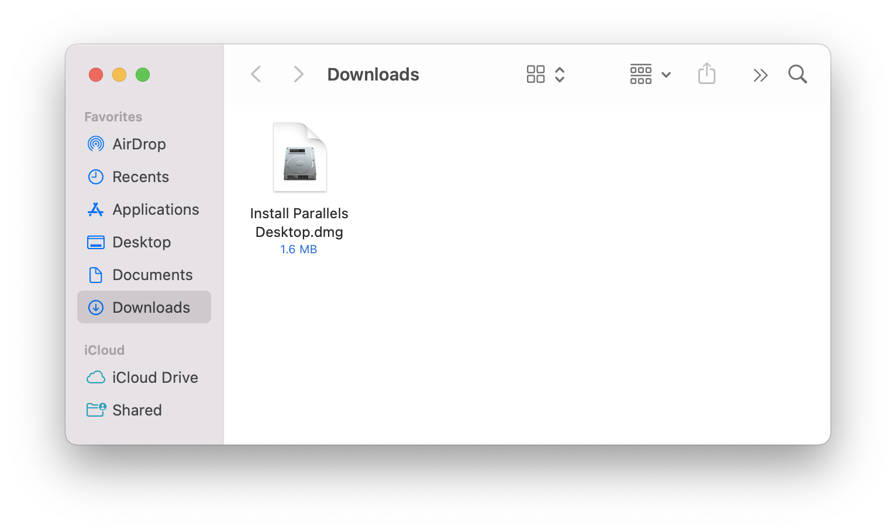
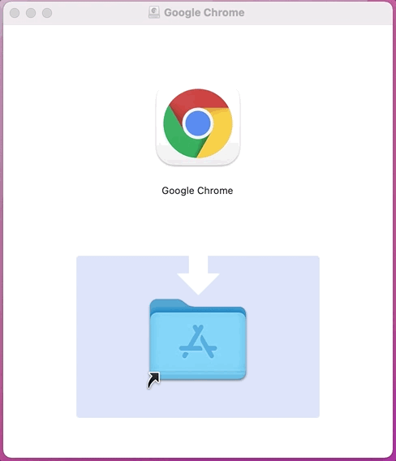
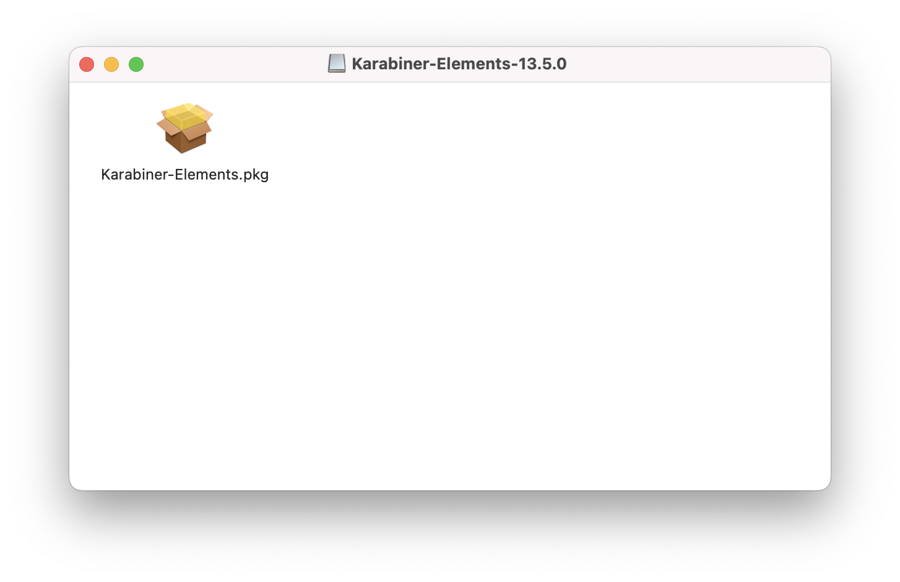
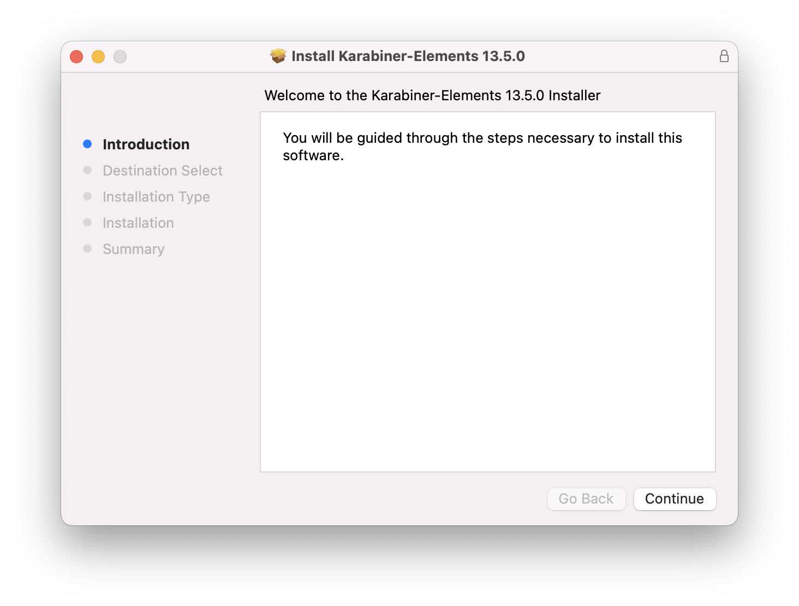
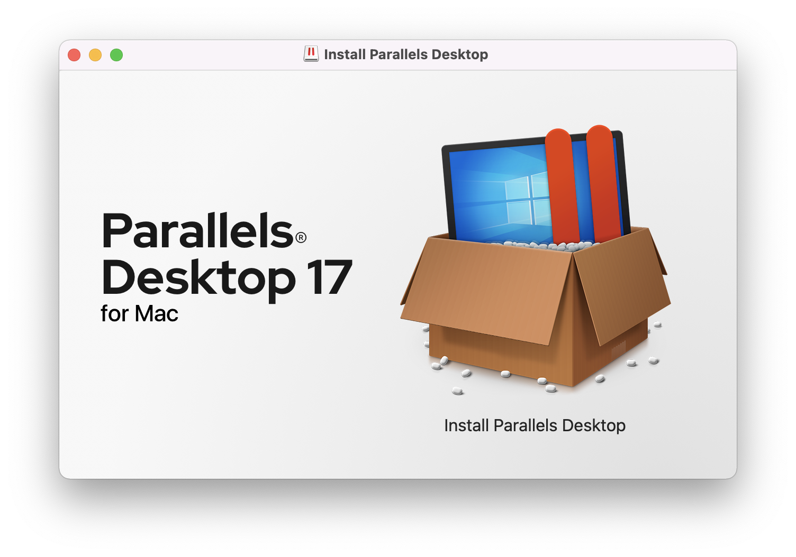
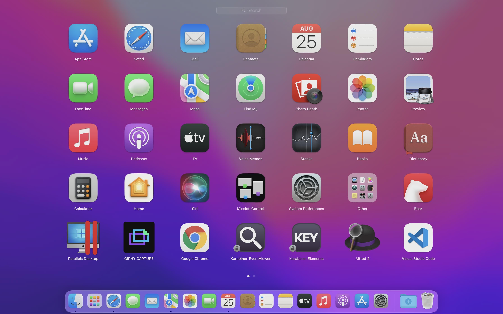
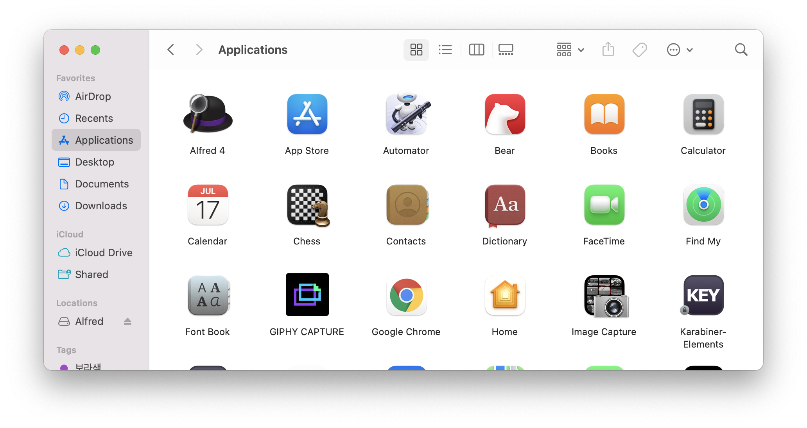
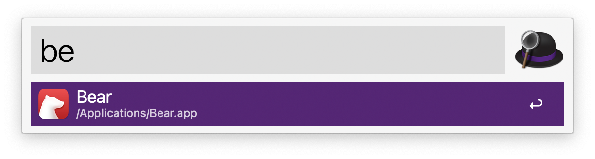
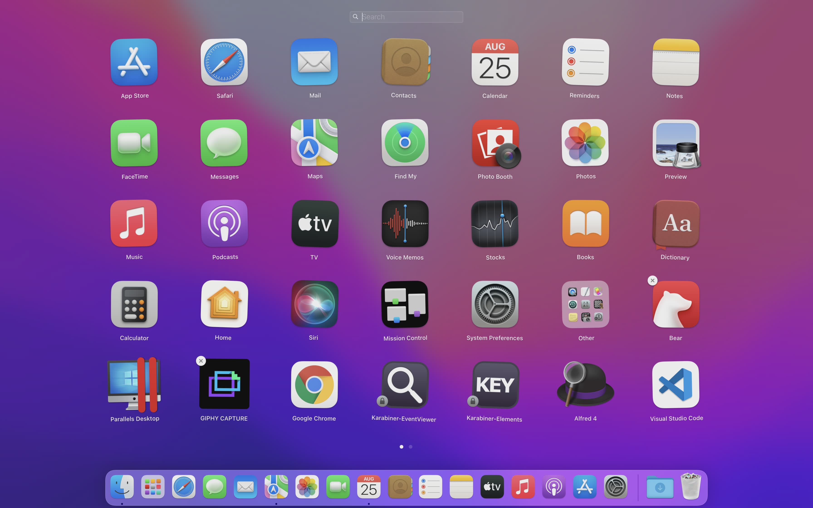

# 앱 설치/실행/삭제

macOS에서 앱 설치는 앱을 `Applications` 폴더로 복사하는 정도고 삭제는 해당 앱을 휴지통에 넣으면 됩니다. Windows의 레지스트리와 비슷한 개념이 없기 때문에, 비교적 직관적이고 단순하게 앱을 관리할 수 있습니다.

특수한 권한을 요구하는 일부 앱의 경우 별도 인스톨 프로그램으로 설치하지만, 대부분 단순한 방식으로 관리합니다.

## 설치

크게 앱스토어를 통한 설치와 인터넷에서 프로그램을 다운받는 방식, Homebrew를 이용하는 방법이 있습니다.

많은 응용 프로그램들이 앱스토어에 등록되어 있지만, 모바일처럼 강제가 아니다 보니 자체 홈페이지에서 제공하는 경우가 더 많습니다. 홈페이지에서는 무료, 앱스토어에서는 유료로 판매하는 경우도 있으므로 앱을 설치할 때 확인이 필요합니다.

### 앱스토어에서 설치

**App Store**



iOS, Android 앱 설치와 동일한 방식입니다.

애플에서 만든 앱들(Pages, Numbers, Keynote, iMovie, ...)과 Xcode, 카카오톡 등이 앱스토어로 제공됩니다.

:::tip Apple Silicon (M1)
Apple Silicon 기반 Mac에 iOS 앱을 설치할 수 있습니다. (제조사에서 허용해야 가능)
:::

### 다운로드한 앱 설치

<div class="image-600 no-radius">



</div>

인터넷에서 받은 설치파일은 대부분 `.dmg(디스크 이미지)` 형태입니다. 디스크 이미지를 실행하면 드라이브처럼 마운트되고 파인더 좌측 사이드바에서 확인할 수 있습니다. 설치가 끝나면 `.dmg`파일은 제거해도 됩니다.

**복사하기**

<div class="image-300 no-radius">



</div>

대부분의 앱 설치 방식입니다. 앱과 `Applications` 폴더가 보인다면 앱을 드래그하여 `Applications` 폴더에 복사합니다. 그럼 끝!

**.pkg 파일 설치**

<div class="image-600 no-radius">




</div>

`.pkg` 파일이 보인다면 더블 클릭하여 설치합니다. 일부 추가 권한이 필요한 앱들이 사용합니다.

**인스톨 파일 설치**

<div class="image-600 no-radius">



</div>

가~~끔 직접 만든 설치 프로그램을 제공하기도 합니다. 더블 클릭하여 설치합니다.

### Homebrew Cask 설치

[Homebrew](https://brew.sh/index)는 CLI 패키지 매니저로 유명하지만, 일반 애플리케이션을 설치할 때도 유용합니다.

```sh
# ex) maccy 앱 설치
brew install --cask maccy
```

## 실행

다양한 실행 방법 중에 편한 방법을 선택하세요.

**Launchpad**



- 엄지와 세 손가락 모아서 Launchpad를 실행합니다.

**Dock**


- 자주 사용하는 앱을 Dock에 등록하고 사용합니다.

**Applications Folder**



- Finder에서 Applications 폴더를 열고 앱을 실행합니다.

**Spotlight / Alfred**

<div class="image-450 no-radius">



</div>

- 키보드로 원하는 앱 이름을 검색하여 실행합니다.

## 삭제

**Launchpad**



앱스토어에서 설치한 앱을 삭제하는 방법입니다. 아이콘을 오랫동안 누르고 있으면 아이콘이 흔들흔들하면서 좌측 상단에 `X` 표시가 뜹니다.

**Applications Folder**

휴지통으로 드래그하여 이동하거나 `⌘(command)` + `⌫(delete)`로 삭제합니다.

**Homebrew Cask 삭제**

brew로 설치한 프로그램은 brew로 삭제합니다.

```sh
# ex) maccy 앱 삭제
brew uninstall --cask maccy
```

:::warning 삭제 프로그램
가~~끔 별도의 삭제 프로그램을 제공하는 경우가 있습니다. 그런 경우 보통 별도로 방법을 제공하기 때문에 확인 후 삭제합니다.
:::
