# 기본 앱

macOS에 기본으로 내장되어 있는 앱을 살펴봅니다.

::: tip App Store
Pages, Keynote, Numbers, iMovie는 App Store에서 무료로 다운로드할 수 있습니다.
:::

## 생산성

계산기  
Calculator

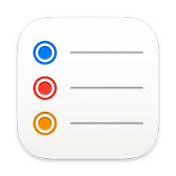

미리알림  
Reminders

스티커  
Stickies

메모  
Notes

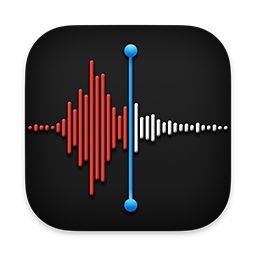

음성 메모  
Voice Memos

스크린샷  
Screenshot

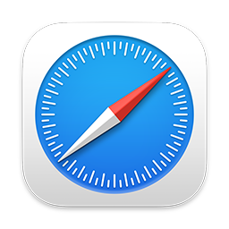

Safari

- 계산기: 복잡한 계산을 할 때 사용합니다. 간단한 계산(덧셈, 곱하기 등)은 Alfred나 Spotlight 입력창에서 바로 수식을 입력해보세요.
- 미리알림: 목록을 만들어서 할 일을 관리합니다. 일정이나 위치에 따라 알림을 받고 공유할 수 있습니다.
- 스티커: 바탕화면에 떠 있는 스티커를 생성합니다. 자주 보는 간단한 메모를 관리합니다.
- 메모: 메모와 + 이미지를 폴더별로 관리합니다. 기록해둘 메모, 회의록 등을 작성할 때 좋습니다.
- 음성메모: 녹음이 필요할 때 사용합니다.
- 스크린샷: 스크린샷을 찍을 때 사용하는데, 보통 전체화면이나 영역, 창 단위로 하는 경우엔 [단축키](./shortcut)가 더 유용합니다.
- Safari: 기본 웹 브라우저입니다.

## 업무

캘린더  
Calendar

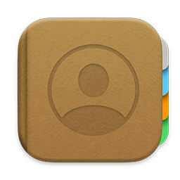

연락처  
Contacts

Mail

Numbers

Pages

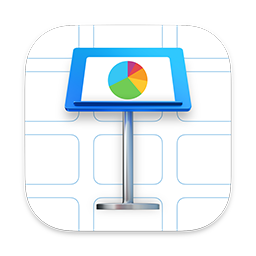

Keynote

- 캘린더: 일정관리 프로그램입니다. 다양한 외부 서비스와 연동이 가능합니다.
- 연락처: 연락처 관리 프로그램입니다. 다양한 외부 서비스와 연동이 가능합니다.
- Mail: 이메일 관리 프로그램입니다.
- Numbers: macOS용 엑셀 프로그램입니다.
- Pages: macOS용 워드 프로그램입니다.
- Keynote: macOS용 파워포인트 프로그램입니다. 간단하게 멋진 슬라이드를 손쉽게 만들 수 있습니다.

## 멀티미디어

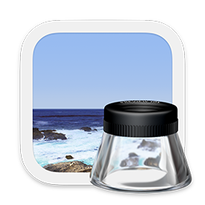

미리보기  
Preview

사진  
Photos

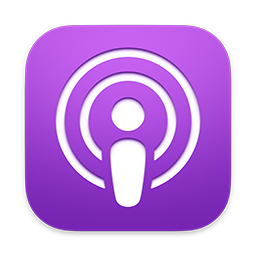

팟캐스트  
Podcasts

iMovie

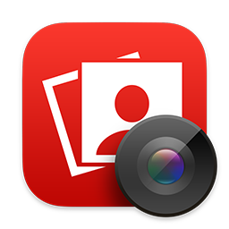

Photo Booth

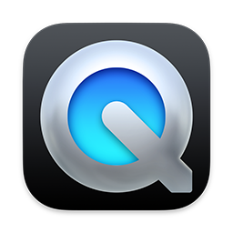

QuickTime Player

- 미리보기: 이미지, PDF, 동영상, 텍스트 등 다양한 포멧의 파일을 볼 수 있는 뷰어이자, 간단한 편집도 가능한 프로그램입니다.
- 사진: 사진 관리 프로그램입니다. 사진을 편집하고 효과를 줄 수 있습니다.
- 팟캐스트: 팟캐스트 프로그램입니다. 다양한 방송을 들을 수 있습니다.
- iMovie: 동영상 편집 프로그램입니다. 기능은 단순하지만 쉽고 간편하게 사용할 수 있습니다.
- Photo Booth: 사진 촬영 프로그램입니다. 재밌는 효과가 많습니다.
- QuickTime Player: 기본 내장된 동영상 재생 프로그램입니다. 다양한 코덱을 지원하진 않기 때문에 IINA와 같은 별도 프로그램이 필요합니다.

## 유틸리티

활성 상태 보기  
Activity Monitor

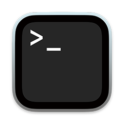

터미널  
Terminal

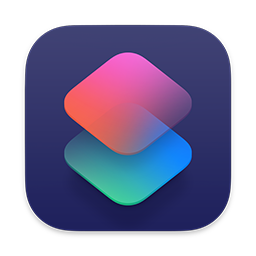

단축어  
Shortcuts

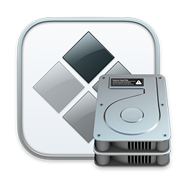

Boot Camp 지원  
BootCamp Assistant

- 활성 상태 보기: 현재 실행 중인 프로그램을 모니터링할 수 있습니다. Apple Silicon을 사용할 경우 실행 중인 앱이 네이티브인지 가상화인지 확인할 수 있습니다.
- 터미널: 기본 터미널 프로그램입니다. 간단한 CLI 작업이나 초기설정을 하고 기본 터미널 대신 iTerm2를 별도로 설치하는 경우가 많습니다.
- 단축어: macOS Monterey에 처음 추가된 단축어 기능입니다. 활용도가 무궁무진하기 때문에 다양한 사례가 나오면 유용할 것 같습니다.
- Boot Camp 지원: Windows를 별도 파티션에 설치할 때 사용하는 프로그램입니다.
