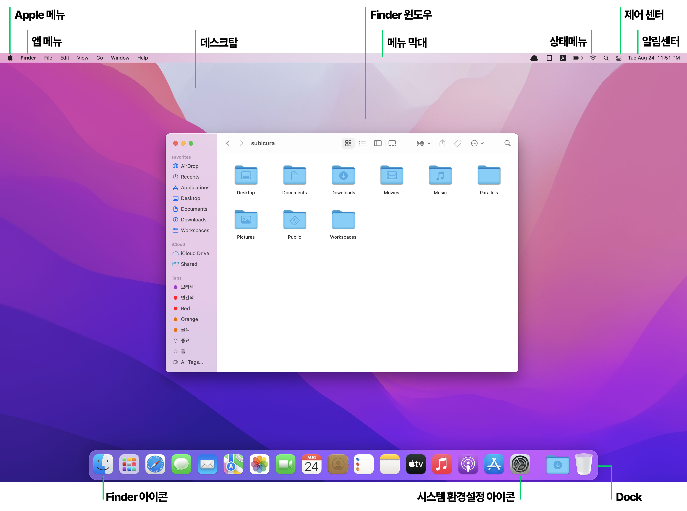
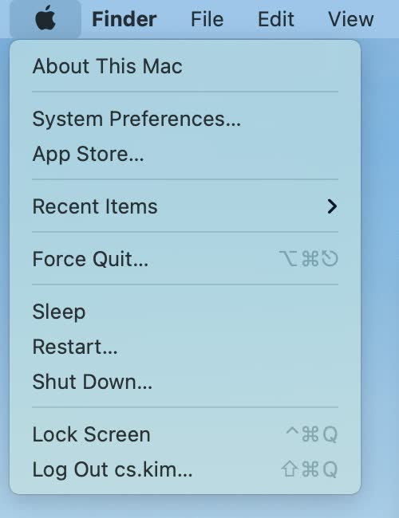
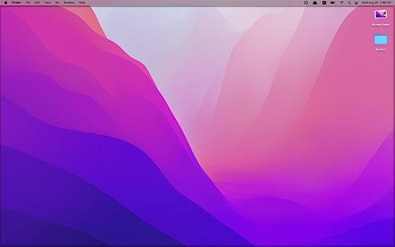
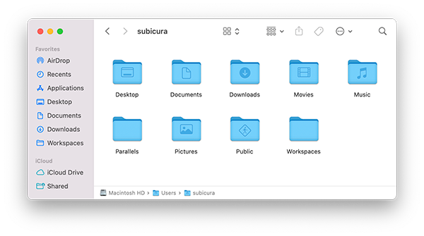
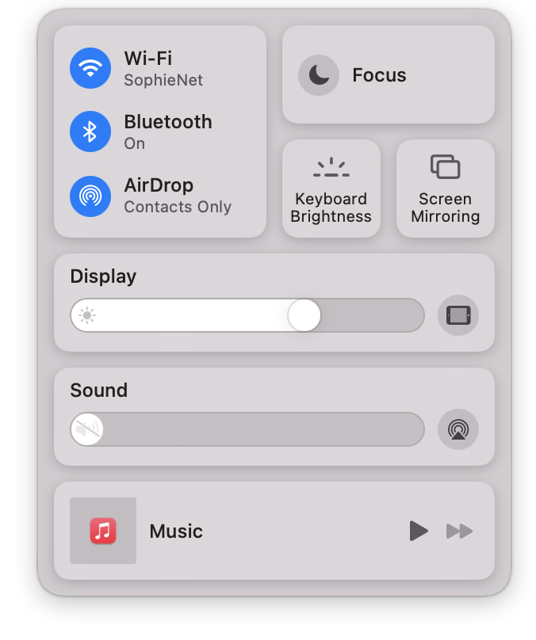
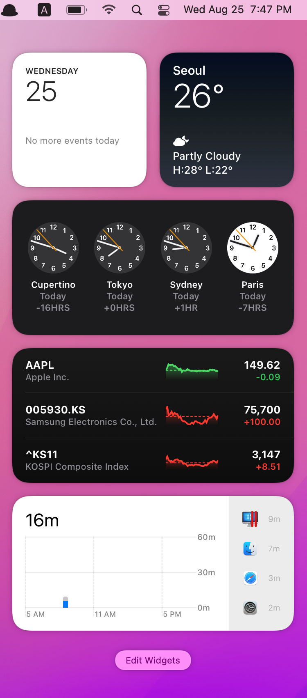
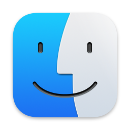
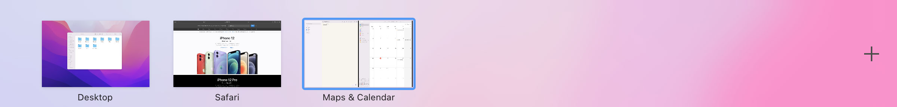
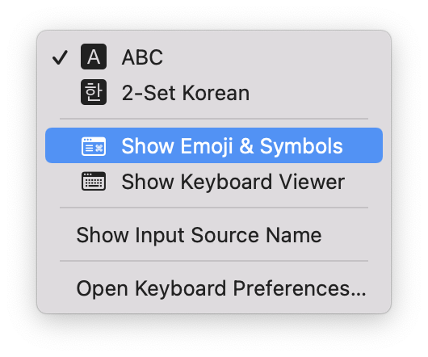
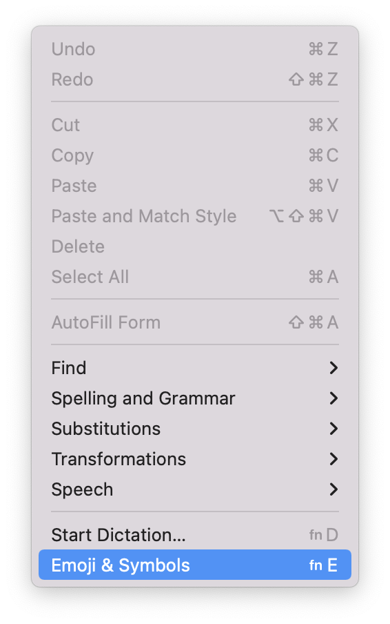

# 인터페이스

macOS 기본 인터페이스를 소개합니다.

> Windows와 큰 차이는 `시작 버튼`이 없다는 점입니다.

## 화면

**Apple 메뉴**

- Apple 메뉴는 시스템 환경설정, 재시작, 종료 등 자주 사용되는 명령을 포함하며, 항상 화면 왼쪽 상단 모서리에 표시됩니다.

**앱 메뉴**

- 활성화된 앱의 이름과 해당 앱의 고유 메뉴가 표시됩니다. ~~그때그때 달라요~~
- `Windows와 차이점` macOS는 Windows와 달리 창에 메뉴를 노출하지 않고 최상단 메뉴 막대에 메뉴를 노출합니다.

**데스크탑**

- 작업을 수행하는 공간이면서 홈Home 폴더 밑의 데스크탑Desktop 폴더를 가리킵니다.
- `Windows와 차이점` macOS의 데스크탑은 주로 파일과 폴더를 관리하고 앱 바로가기는 하단 `Dock`에 표시합니다.

**Finder 윈도우**

- Finder 앱 윈도우 입니다. Finder는 Windows의 탐색기와 비슷한 역할을 합니다.

**상태 메뉴**

- 상태 메뉴는 일반적으로 아이콘으로 나타나며, 이를 통해 배터리 충전량과 같은 Mac 상태를 확인하거나 각종 앱에 접근할 수 있습니다.
- 시스템과 함께 자동으로 실행되는 앱(패스워드 관리나, 키입력 관리등)은 Dock이 아닌 상태 메뉴에 주로 표시됩니다.
- `⌘(command)`를 누르고 아이콘을 드래그하여 순서를 변경할 수 있습니다.
- 아이콘이 너무 많으면 앱 메뉴에 가려져 안보일 수 있습니다. 🤔 ([Bartender](https://www.macbartender.com/)같은 서드파티 앱을 이용해서 해결)

**제어 센터**

- 제어 센터 아이콘을 클릭하여 제어 센터를 열고 AirDrop, AirPlay, 방해금지 모드와 같이 자주 사용하는 기능에 접근할 수 있습니다.
- 제어 센터에서 자주 사용하는 항목을 드래그해서 메뉴 막대에 넣거나 `System Preferences...` > `Dock & Menu Bar`에서 메뉴 막대에 노출할 기능을 선택합니다.
- 마우스 오버 후 화살표(>)를 선택하면 상세 옵션을 볼 수 있습니다.

**알림 센터**

- 날짜와 시간을 클릭하여 알림 센터를 열면 일정, 메모, 날씨 등을 보고 놓친 알림을 확인할 수 있습니다.
- 위젯을 설정하고 추가/삭제 할 수 있습니다.

**Finder 아이콘**

- Finder 실행 아이콘입니다. Dock에 있는 다른 아이콘은 제거할 수 있지만, Finder는 제거할 수 없습니다.

**시스템 환경설정 아이콘**

- 시스템 환경설정 실행 아이콘입니다. `Apple 메뉴` > `System Preferences...`와 동일합니다.

**Dock**

- 실행 중인 앱을 보여주고 자주 사용하는 앱의 바로가기를 제공합니다.
- 오른쪽 버튼을 누르고 Dock에 고정하거나 제거할 수 있습니다.
- 앱 추가 영역: 자주 사용하는 앱을 배치하고 마음껏 추가/삭제할 수 있습니다. 드래그하여 순서를 변경합니다.
- 최근 사용한 앱 영역: 앱 추가 영역에 없는 앱 중에 실행했던 앱을 표시합니다.
- 파일/폴더 추가 영역: 자주 사용하는 파일 또는 폴더를 추가할 수 있습니다.

## 미션 컨트롤 Mission Control

미션 컨트롤을 이용하여 가상 데스크탑을 여러 개 사용합니다.

- 터치패드에서 네 손가락을 아래에서 위로 움직이면 미션 컨트롤이 나타납니다.
- 상단에 현재 생성된 Spaces 목록을 확인합니다.
- `+`를 눌러 새로운 Spaces를 추가합니다.
- Drag & Drop으로 위치를 변경할 수 있습니다.
- 2개의 풀스크린 앱을 하나의 Space로 통합(Split View)할 수 있습니다.

[공식 설명서](https://support.apple.com/ko-kr/HT204100)

## 트랙패드

:::tip 트랙패드 설정
세부적인 트랙패드 동작 방식은 설정에서 바꿀 수 있습니다. `System Preferences...` > `Trackpad`
:::

**기본 기능**

- 오른쪽 버튼 선택: 두 손가락으로 터치하기 또는 `⌃(control)` 누른 상태로 클릭
- 스크롤: 두 손가락으로 위/아래/왼쪽/오른쪽 스크롤

**고급 기능**

- 줌인/아웃: 두 손가락을 모으거나 펴기
- 뒤로가기/앞으로가기: 두 손가락을 좌로 또는 우로 이동
- 스페이스(전체화면 앱) 변경: 네 손가락을 좌로 또는 우로 이동
- 미션 컨트롤(스페이스 선택): 네 손가락을 아래에서 위로
- 런치패드 실행: 엄지와 세 손가락 모으기

## 한글/영어/한자/이모지

**한글/영어 전환**

- `CapsLock` 또는 `⌃(Ctrl)` + `Space`로 한/영 전환합니다. (기본설정)
- 전환키는 `System Preferences...` > `Keyboard` > `Shortcuts` > `Input Sources`에서 변경할 수 있습니다.

**한자 입력**

- 한글을 입력하고 `⌥(Option)`+`Enter`를 입력합니다.
- 단어를 선택하고 `⌥(Option)`+`Enter`를 입력해도 됩니다.

**이모지 입력**

- **방법 1.** `⌃`+`⌘`+`Space`를 입력합니다.

- **방법 2.** 메뉴 막대 > 키보드 입력 선택(A/한) 팝업에서 `Show Emoji & Symbols`를 선택합니다.

- **방법 3.** 메뉴 막대 > `Edit` > `Emoji & Symbols`를 선택합니다.
