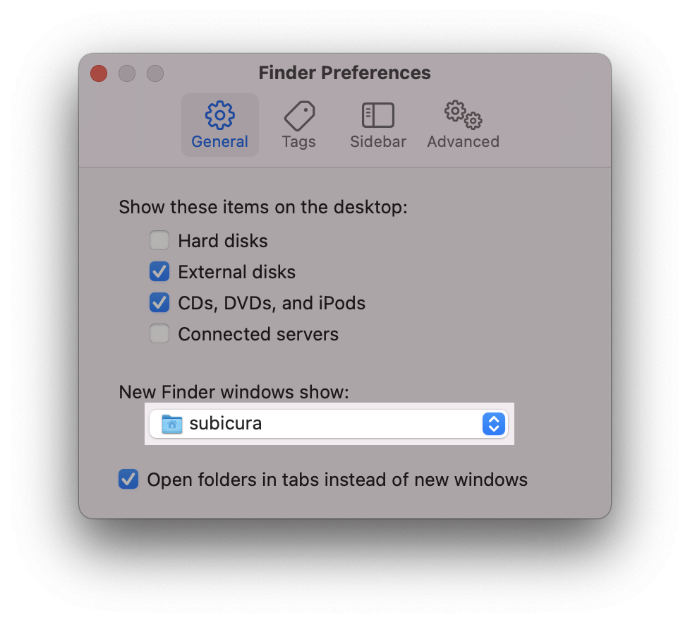
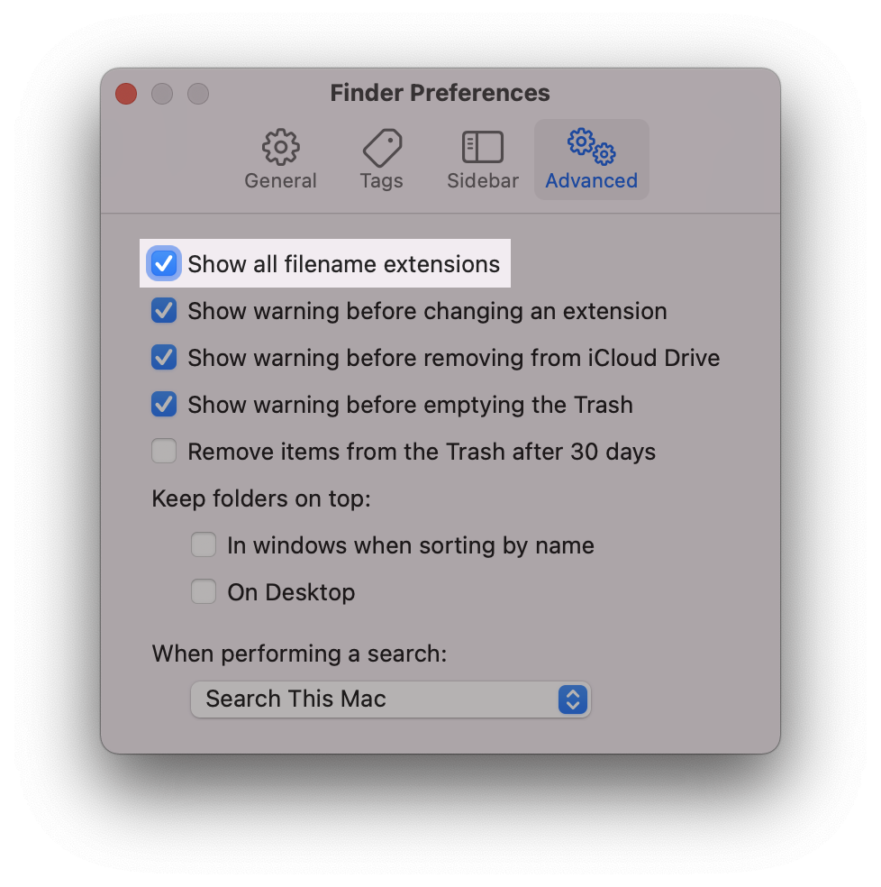
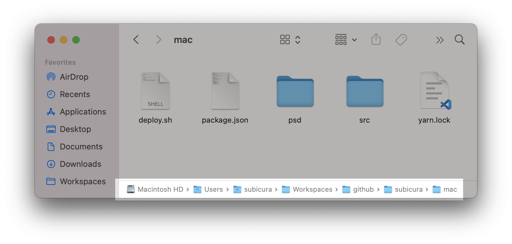
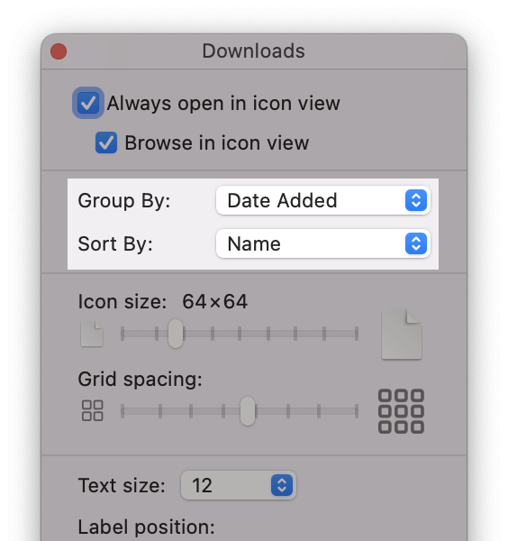

# 파인더 설정

`Finder`를 실행하고 `⌘` + `,` (`Finder` > `Preferences...`)를 선택합니다.

:::tip 자동 설정 스크립트
하나하나 설정하기 귀찮으신 분은 [자동 설정 스크립트](./setting) 페이지를 참고해 주세요.
:::

## 공통 설정

- `General` > `New Finder windows show`: subicura (home folder)
- 기본값인 `최근 본 파일` 옵션은 파인더 실행 시 버벅대면서 늦게 열릴 때가 있습니다. 버벅이지 않도록 기본 폴더를 홈 폴더로 설정합니다.

- `Advanced` > `Show all filename extensions`: 체크함
- 모든 파일의 확장자를 보여줍니다.

- 파인더 하단에 현재 경로를 표시하고 싶다면 파인더 App 메뉴에서 `View` > `Show Path Bar` 선택합니다.

## 다운로드 폴더 옵션

`Downloads` 폴더로 이동하고 `⌘` + `J` (`View` > `Show View Options`)를 선택합니다.

### 정렬 변경

- `Group By`:Date added, `Sort By`:Name
- 파일 목록을 저장한 날짜별로 그룹화하고 그룹 내에서 이름으로 다시 정렬합니다.
- 다운로드 폴더 특성상 최근에 받은 파일들을 찾는 경우가 많으므로 유용합니다.
