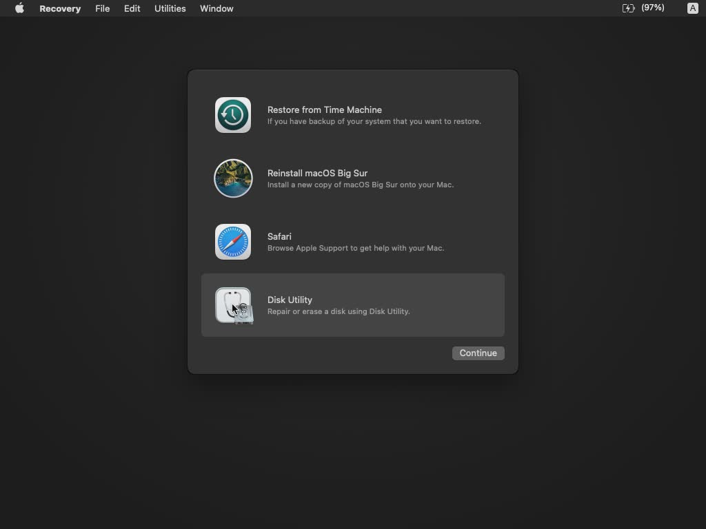
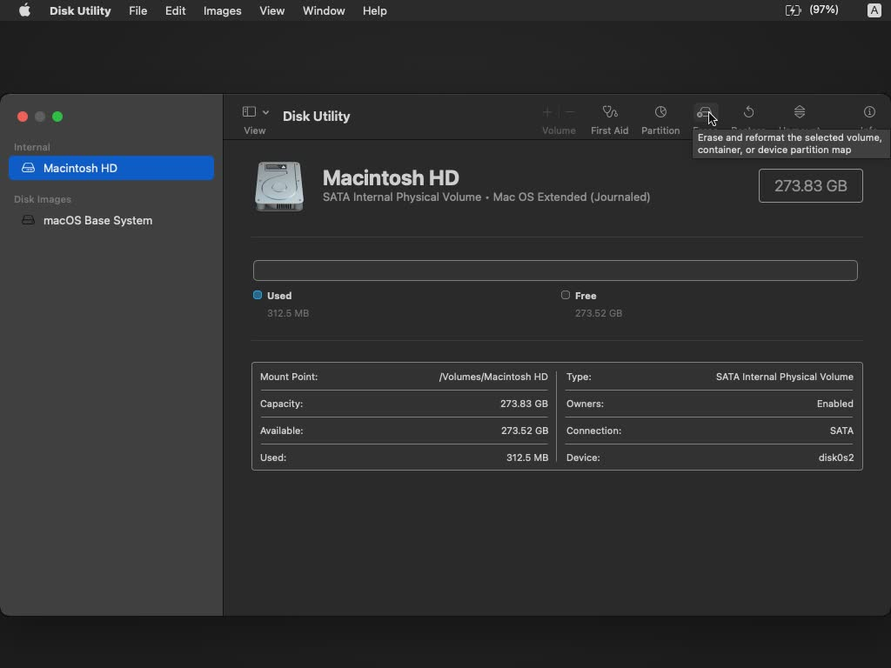
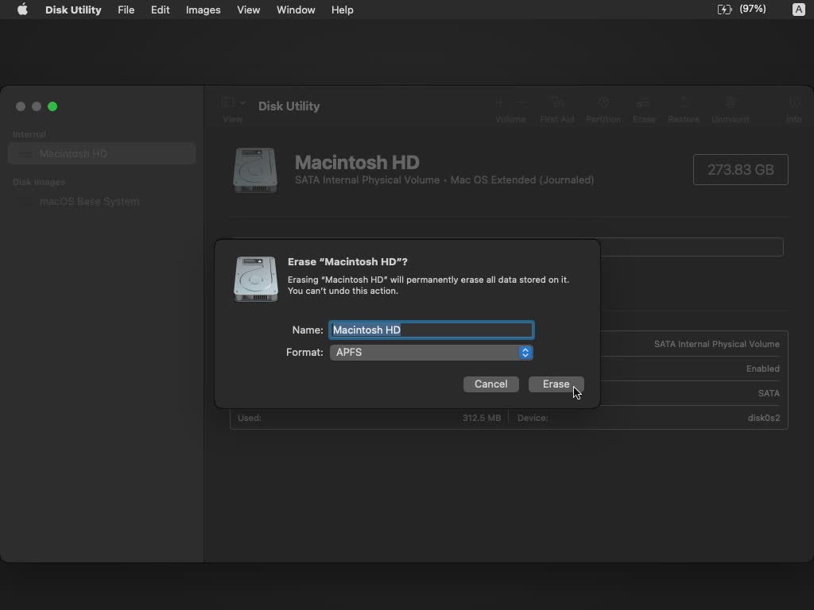
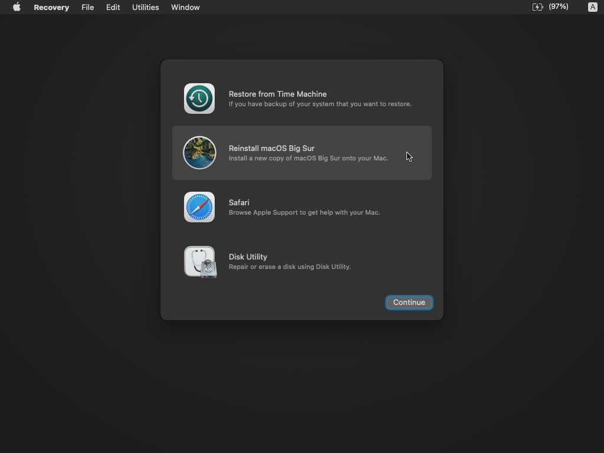
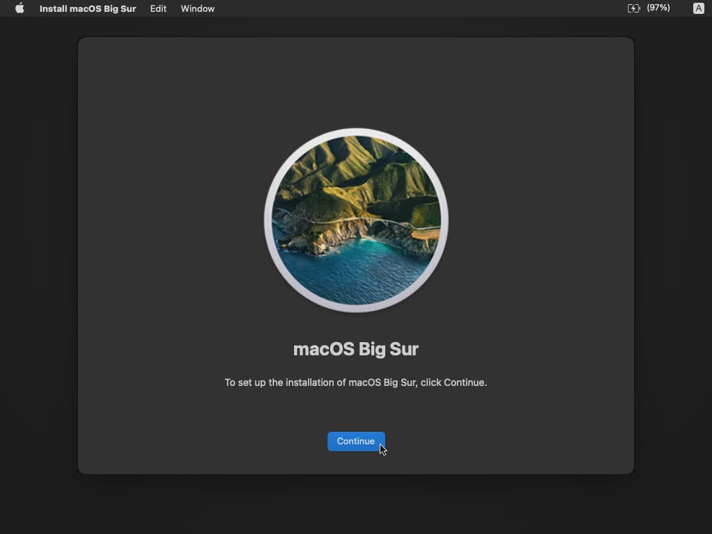
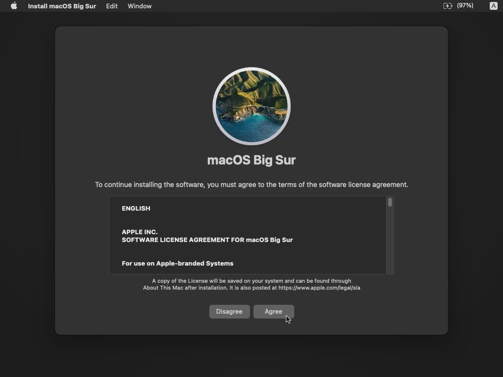
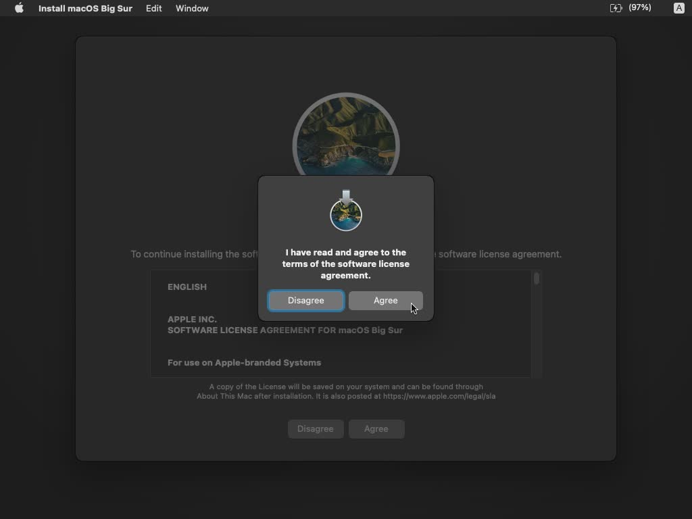
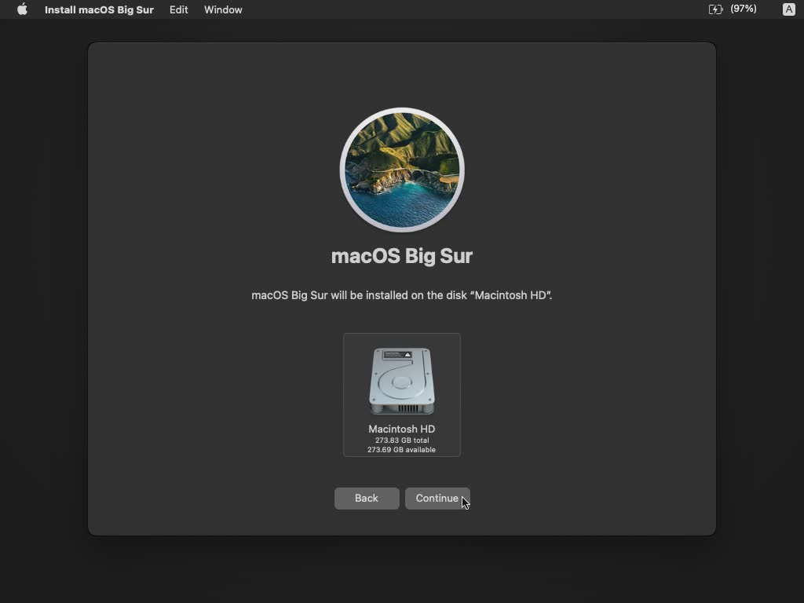
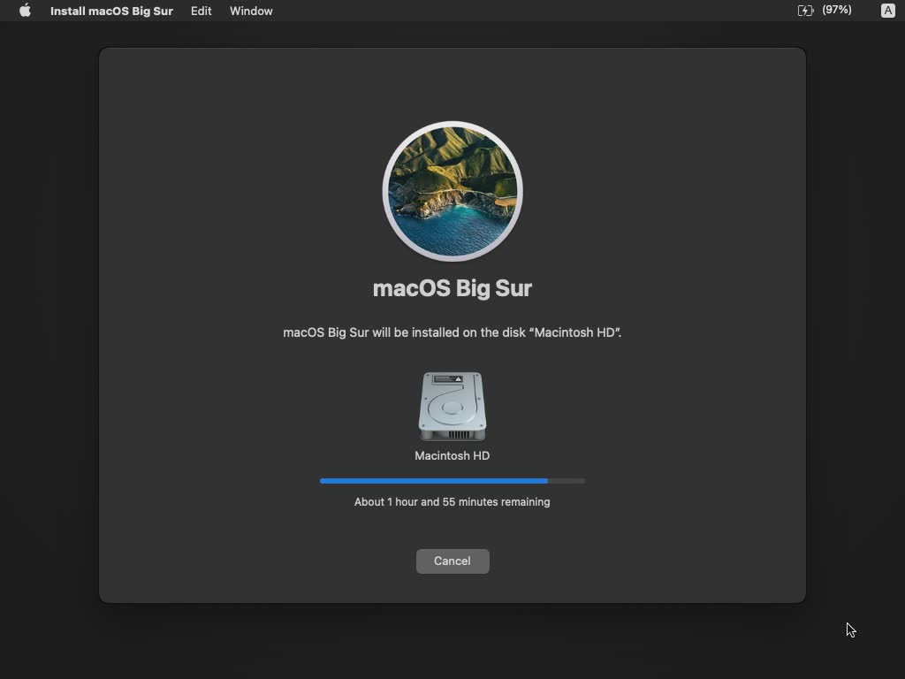

# 재설치

## 재설치

사용중 계속해서 문제가 발생하거나 이전 데이터를 초기화 하기 위해 macOS를 재설치하는 방법을 알아봅니다.

::: warning 주의
초기화하면 모든 파일이 사라지므로 중요한 파일을 미리 백업하세요!
:::

**macOS 복구모드 진입하기**

1. macOS 재시작 (또는 종료 후 다시 전원 버튼 누르기)
2. 재시작 직후

- `Intel` - `Command(⌘)`+`R` 길게 누르기
- `Apple Silicon` - `Loading Startup Option..`이 나타날 때까지 Mac의 전원 버튼 길게 누르기

3. macOS Recovery 모드 진입
4. (선택) 계정을 선택하고 패스워드 입력

1. `Disk Utility` 선택

2. `Macintosh HD(또는 기본 볼륨)` 선택 후 `Erase` 선택

3. `APFS` Format으로 초기화
4. `Macintosh HD - Data` 볼륨이 보인다면 `-(Volume)` 선택 후 제거

5. `Reinstall` 메뉴 선택

6. `Continue` 선택

7. `Agree` 선택

8. `Agree` 선택

9. `Continue` 선택

10. 설치중

11. 재부팅 후 마무리 작업

**참고**

- [공식문서](https://support.apple.com/ko-kr/guide/mac-help/mchlp1599/mac)
